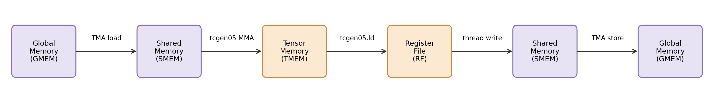

# Background: Blackwell GPU Architecture
:label:`chap_background`

Before diving into the code, let's understand the key hardware features of NVIDIA Blackwell GPUs. If you're familiar with CUDA, you already know about threads, warps, shared memory, and global memory. Blackwell introduces several new hardware units and memory spaces that are essential for achieving peak performance.

## Thread Hierarchy

Blackwell organizes threads into a nested hierarchy:

- **CTA** — short for *Cooperative Thread Array*, the same concept that CUDA programmers know as a thread block. It is the basic scheduling unit: a CTA runs on a single SM and has access to that SM's shared memory. A CTA contains one or more warpgroups of 128 threads each; most kernels in this tutorial use one warpgroup per CTA, and the warp-specialized kernels in :numref:`chap_gemm_advanced` and :numref:`chap_flash_attention` use up to four.

- **Warpgroup**: 4 consecutive warps (128 threads). On Blackwell, this is the cooperation unit for TMEM reads and tcgen05 MMA operations.

- **Warp**: A warp contains 32 threads and is the basic SIMT execution unit.

- **Thread**: Each thread is identified by a lane ID within its warp.

- **Cluster**: A group of cooperating CTAs.

## Memory Hierarchy

For TIRX kernels on Blackwell, it is useful to think about memory as a hierarchy spanning GMEM, SMEM, TMEM, and registers:

| Memory | Ownership | Latency | Description |
|--------|-----------|---------|-------------|
| **Global Memory (GMEM)** | Device-wide | High | Large capacity (HBM), bandwidth-limited |
| **Shared Memory (SMEM)** | Per-CTA (on one SM) | Low | 228 KB per SM, low-latency scratchpad |
| **Tensor Memory (TMEM)** | Per-SM | Very low | Private high-bandwidth accumulator memory for Tensor Cores |
| **Register File (RF)** | Per-thread | Lowest | Fastest storage, per-thread |

The typical data flow for a kernel that uses Tensor Cores:

The key difference from earlier GPU generations is that tcgen05 writes accumulator results to TMEM first, and software later moves them to registers or shared memory as needed.

**Tensor Memory (TMEM)** is new in Blackwell. It is a high-bandwidth scratchpad memory private to the Tensor Cores. The tcgen05 MMA unit writes its accumulator output directly to TMEM, not to registers or shared memory.

- **TMEM reads are explicit and cooperative.** To consume MMA results, software must explicitly load from TMEM into the register file. These reads are performed cooperatively by the full warpgroup (128 threads).

- **TMEM uses its own addressing and allocation model.** It is not accessed like normal memory; instead, it uses a special 2D address space whose rows are indexed by a hardware axis called `TLane` (128 lanes) and whose columns are indexed by `TCol` (up to 512 columns). TMEM must be explicitly allocated and deallocated. The `TLane` axis has the same 128-element cardinality as a warpgroup, which is why a `tcgen05.ld` can pair TMEM rows with warpgroup threads one-to-one (see :numref:`chap_layouts` for the exact matching rule).

## TMA (Tensor Memory Accelerator)

TMA is a hardware unit that asynchronously copies rectangular tiles between global memory and shared memory. TMA lets software describe a tile copy, and hardware performs it asynchronously in the background.

- **Single-thread launch**: One thread issues the TMA operation, and the hardware performs the actual tile transfer asynchronously in the background. The remaining threads are free to do other work.

- **Swizzled layouts**: TMA can apply layout swizzling during the transfer, helping produce shared-memory layouts that are friendly to Tensor Core access.

- **Barrier integration**: TMA works with mbarriers. The programmer specifies the expected byte count with `arrive.expect_tx`, and the hardware signals completion when that amount of data has arrived.

- **Store support**: TMA is not only for GMEM→SMEM loads; it can also store data from SMEM back to GMEM. TMA stores use a commit-group / wait-group mechanism for completion tracking.

In short, TMA turns tiled GMEM↔SMEM movement into an asynchronous hardware operation with built-in layout and synchronization support.

## Tensor Cores: The Compute Engine

Before looking at the Blackwell-specific `tcgen05` instruction, it is worth stepping back to understand what a Tensor Core is and why the MMA API looks the way it does. If you are already comfortable with Hopper-era `wgmma`, you can skim this section.

A **Tensor Core** is a dedicated hardware unit that, in one instruction, performs a full tile-granularity matrix multiply-accumulate:

$$D = A \times B + C, \quad A \in \mathbb{R}^{M \times K},\ B \in \mathbb{R}^{K \times N},\ C, D \in \mathbb{R}^{M \times N}.$$

This is in contrast to **CUDA cores**, the GPU's classic general-purpose ALUs that execute scalar fused multiply-add (FMA) — one $d = a \times b + c$ on 32-bit operands, per thread, per cycle. A warp of 32 threads therefore retires at most 32 scalar FMAs per cycle. A single Tensor Core MMA, by contrast, retires the hundreds-to-thousands of FMAs that make up an $M \times N \times K$ tile as one pipelined asynchronous operation. The two engines live on the same SM and complement each other:

| | **CUDA core** | **Tensor Core** ($\texttt{tcgen05}$ on Blackwell) |
|:--|:--|:--|
| Granularity | 1 scalar FMA per instruction | $M \times N \times K$ FMAs per instruction |
| Execution model | SIMT: 32 threads per warp, each issues its own instruction | Single thread (or 2-CTA pair) issues one MMA; hardware runs the tile asynchronously |
| Operands live in | Register file | SMEM (via matrix descriptors) and/or TMEM |
| Accumulator in | Register file | **TMEM** on Blackwell (off-chip-register scratchpad) |
| Typical dtypes | fp32 / fp64 / int32 — general-purpose | fp16 / bf16 / fp8 / fp4 / tf32 — low-precision GEMM-friendly |
| Used for | elementwise, reductions, index math, control flow, everything non-GEMM | dense matrix multiply, convolution, attention $QK^{\top}$ and $PV$ |
| Peak on HGX B200 | ~75 TFLOPS (fp32) | ~2.25 PFLOPS (fp16/bf16) &rarr; up to ~9 PFLOPS (fp4) |

The architectural motivation is simple: dense matrix multiplication dominates deep-learning workloads, has high arithmetic intensity ($O(N^3)$ FLOPs on $O(N^2)$ data), and is therefore compute-bound on a well-fed GPU. A dedicated MMA unit reaches peak throughput that scalar FMAs never can.

### Why You Cannot Ignore Them

On a Blackwell B200:

| Unit | Peak throughput (per GPU, approx.) | Ratio |
|:-:|:-:|:-:|
| FP32 CUDA cores | ~75 TFLOPS | 1× |
| FP16/BF16 Tensor Cores (dense) | ~2.25 PFLOPS | ~30× |
| FP8 Tensor Cores (dense) | ~4.5 PFLOPS | ~60× |
| FP4 Tensor Cores (dense) | ~9 PFLOPS | ~120× |

A kernel that does not use Tensor Cores throws away over 95% of the chip. Every GEMM, attention, and convolution kernel in this tutorial is written around the Tensor Core.

### Instruction Shape ($M \times N \times K$)

A single MMA instruction operates on a fixed-shape tile. On Blackwell `tcgen05.mma` with fp16/bf16 operands:

- $M = 64, 128$ (row tile, "row" here meaning the $M$ dimension of $A$ and $D$)
- $N = 8, 16, 32, 64, 128, 256$ (column tile; the most flexible dimension)
- $K = 16$ (inner-product dimension, fixed)

A GEMM loop builds a larger computation by stepping along $K$ and accumulating. Kernels written later in this tutorial choose $M_{\text{mma}} = 128$ or $256$ (with 2-CTA cooperation) and $N_{\text{mma}} = 128, 256$, but always $K_{\text{mma}} = 16$. The block-level tile `BLK_M × BLK_N × BLK_K` is then a multiple of the instruction tile along each dimension.

### Supported Data Types

Tensor Cores support a rich set of input types with accumulation usually in wider precision:

| Input ($A$, $B$) | Accumulator ($C$, $D$) | Primary use |
|:-:|:-:|:-:|
| FP16, BF16 | FP32 | Training; still common for inference |
| TF32 | FP32 | "Full-precision" training |
| FP8 (E4M3, E5M2) | FP32 | Large-model training and inference |
| FP6, FP4 | FP32 | Inference on weight-quantized models |
| INT8, INT4 | INT32 | Legacy inference; sparsity |

Blackwell additionally supports structured 2:4 sparsity on several of the above dtypes, which can up to double effective throughput by skipping half the multiplies. You will not use sparse MMAs in this tutorial, but you should know they exist.

### Generational Evolution

Understanding why Blackwell's MMA API looks the way it does is easier once you see the previous three generations side by side:

| Gen | Instruction | Issue scope | A source | B source | Accumulator | Async? |
|:-:|:-:|:-:|:-:|:-:|:-:|:-:|
| Volta (V100) | `mma.sync` (wmma) | warp (32 threads) | RF | RF | RF | no |
| Ampere (A100) | `mma.sync` (e.g. `m16n8k16`) | warp | RF | RF | RF | no |
| Hopper (H100) | `wgmma.mma_async` | **warpgroup (128 threads)** | RF **or SMEM** | **SMEM** | RF | **yes** |
| Blackwell (B200) | `tcgen05.mma` | **warpgroup + 2-CTA option** | **SMEM or TMEM** | **SMEM** | **TMEM** | **yes** |

Three trends drive the API you will use in TIRX:

1. **Issue scope grew from warp to warpgroup.** Volta and Ampere treated MMA as a per-warp operation: 32 threads pool their registers to form A, B, and D tiles. Hopper moved the scope to a warpgroup so that a single larger MMA could span 128 threads' worth of data. Blackwell extends this further with a *2-CTA* cooperative mode in which two SMs jointly issue one 256-row MMA.

2. **Operands migrated from RF to SMEM (and TMEM).** Reading A and B from registers forced every thread to hold a share of the tile in its register file. As tile sizes grew, RF pressure became the binding constraint: Hopper's `wgmma` already reads B from SMEM, and one variant reads A from SMEM too. Blackwell completes the move by reading A from either SMEM or TMEM. The result: no matter how large the MMA tile, RF usage does not grow with it.

3. **Execution became asynchronous.** Starting with Hopper, MMA issues a work request and returns immediately; completion is signaled through a separate barrier. This is essential for overlap — the issuing thread is free to prepare the next tile while the current MMA runs in the background.

### Accumulator in TMEM (Blackwell-Specific)

The most radical change on Blackwell is the accumulator location. A Hopper `wgmma` tile with $M=64, N=256$ and FP32 accumulation produces $64 \times 256 = 16384$ accumulator values, which at 128 threads per warpgroup means **128 FP32 registers per thread**. The architectural register file is capped at 255 × 32-bit registers per thread; roughly half of that budget is already gone, and we have not started loading operands or intermediate results. In practice Hopper kernels spend substantial effort managing this pressure (multiple smaller MMAs, register reuse tricks).

Blackwell solves the problem structurally by adding **TMEM** — a 128 × 512 32-bit scratchpad per SM dedicated to accumulators. `tcgen05.mma` writes its output to TMEM, not to registers. The warpgroup only pulls data into registers (`tcgen05.ld`) during the writeback epilogue, when it actually needs to apply activation or cast to the output dtype. Registers are now free for operand pipelining.

This is why every GEMM kernel in Part III follows the same three-stage data flow:

$$\text{GMEM} \xrightarrow{\text{TMA}} \text{SMEM} \xrightarrow{\text{tcgen05.mma}} \text{TMEM} \xrightarrow{\text{tcgen05.ld}} \text{RF} \xrightarrow{\text{store}} \text{GMEM}.$$

Each arrow is a different hardware unit, each with its own synchronization primitive. The next two sections introduce the Blackwell MMA (`tcgen05`) and the barrier system (`mbarrier`) that stitch this pipeline together.

## tcgen05 (Tensor Core MMA)

`tcgen05` is Blackwell's matrix multiply-accumulate (MMA) unit. Depending on the MMA variant, operand A may come from TMEM or SMEM, while operand B is read from SMEM via matrix descriptors. The result is written to TMEM.

- **Asynchronous execution**: The MMA instruction returns immediately while the computation continues in the background.

- **Single-thread issue**: Only one elected thread issues the MMA and its corresponding commit. The operation itself is carried out by hardware on behalf of the warpgroup.

- **TMEM accumulation**: tcgen05 writes its output to TMEM. It can either overwrite the destination (`accum=False`) or accumulate into existing TMEM values (`accum=True`).

- **Commit and completion tracking**: After issuing one or more MMAs, software uses `commit` to group them. The hardware signals the associated mbarrier when the group completes.

- **CTA-group execution**: `cta_group` controls whether one CTA or multiple CTAs cooperate on the same MMA operation. This becomes important for clustered kernels later in the tutorial.

In short, tcgen05 moves MMA accumulation out of registers and into TMEM, which changes both the dataflow and the synchronization model compared with earlier generations.

## Why TMA and Tensor Cores Come Together

The Tensor Core and the TMA are introduced separately, but in practice they are two sides of one problem: a Tensor Core is so fast that, without asynchronous bulk data movement, nothing can keep it fed.

A back-of-the-envelope roofline on B200 makes this concrete. For a fp16 GEMM with K-inner dimension $K$, one tile of size $M \times N$ consumes:

$$
\text{FLOPs per tile} = 2 \cdot M \cdot N \cdot K, \qquad
\text{bytes per tile} = 2 \cdot (M + N) \cdot K.
$$

Arithmetic intensity is $\text{FLOPs} / \text{bytes} = M \cdot N / (M + N)$. For $M = N = 128$ this is $64$ FLOP/B; for $M = N = 256$ it is $128$ FLOP/B.

The Tensor Core delivers roughly $2.25 \times 10^{15}$ FLOPs/s; HBM3e on B200 delivers roughly $8 \times 10^{12}$ B/s. The **break-even arithmetic intensity** is:

$$
\text{AI}_{\text{breakeven}} = \frac{2.25 \times 10^{15}}{8 \times 10^{12}} \approx 280 \text{ FLOP/B}.
$$

A $128 \times 128$ tile at 64 FLOP/B is four times *below* the break-even; even a $256 \times 256$ tile at 128 FLOP/B is roughly half. The only way to reach peak Tensor Core throughput is to hide the load behind the compute. This is exactly what TMA is designed for:

- TMA executes asynchronously, so the warpgroup that just issued an MMA can immediately request the next tile without waiting.
- TMA is issued by a single elected thread, so 127 other threads are free to do useful work (in warp-specialized kernels, most of them are executing a different MMA on a different tile).
- TMA saturates the memory system: one `cp.async.bulk.tensor` instruction can move a full 128×64 fp16 tile (16 KB) in a single transaction.

Software pipelining (:numref:`chap_gemm_async` Step 5) and warp specialization (:numref:`chap_gemm_advanced` Step 7) are the software patterns that turn this hardware capability into sustained throughput. By the end of Part III you will see a kernel that issues a TMA load for tile $k+2$ while the MMA runs on tile $k+1$ and the writeback reads tile $k$ from TMEM — three independent hardware units working simultaneously on three consecutive tiles.

If you remember one number from this chapter: **break-even arithmetic intensity on B200 is ~280 FLOP/B**. Any GEMM below that intensity is bandwidth-bound; reaching the Tensor Core roof requires either larger tiles or multi-tile pipelining — and usually both.

## mbarrier (Memory Barrier)

mbarriers are hardware synchronization primitives stored in shared memory. They combine a counter with a phase bit to enable reusable, asynchronous synchronization.

**Lifecycle of an mbarrier:**

1. **Init**: Set the expected number of arrivals. The barrier starts at phase 0.
2. **Arrive**: Each arrival decrements the counter. There are three ways to arrive:
   - **TMA auto-arrive**: The hardware arrives automatically once the byte transfer completes (tracked via `expect_tx`).

   - **tcgen05 auto-arrive**: The hardware arrives once committed MMAs complete.

   - **Thread arrive**: A thread arrives explicitly (used by writeback threads to signal "TMEM is free").
3. **Wait**: A consumer waits until the barrier reaches the expected phase for that iteration, which indicates that all required arrivals have completed.
4. **Phase flip**: Once all arrivals are done, the barrier automatically toggles its phase (0 → 1 → 0 → ...). This lets the same barrier be reused across loop iterations: iteration 0 uses phase 0, iteration 1 uses phase 1, iteration 2 uses phase 0 again, etc.

This is the basic producer-consumer pattern used throughout the tutorial: a producer (for example, TMA) arrives on a barrier when data is ready, and the consumer waits on that barrier before using the data.

## Synchronization Rules

Blackwell has multiple asynchronous hardware units (threads, TMA, tcgen05 MMA) that read and write different memory spaces. Whenever data crosses from one unit or memory space to another, you need explicit synchronization:

| Data flow | Synchronization needed |
|:-:|:-:|
| Threads write SMEM → MMA reads SMEM | `cta_sync()` + `fence.after_thread_sync()` |
| MMA writes TMEM → Threads read TMEM | `mbarrier.try_wait` + `fence.after_thread_sync()` |
| Threads write SMEM → TMA reads SMEM (store) | `fence.proxy_async("shared::cta")` |
| Alloc barriers/TMEM → Use them | `fence.proxy_async` + `fence.mbarrier_init` + `cta_sync()` |
| All work done → Deallocate TMEM | `cta_sync()` (single-CTA) or `cluster_sync()` (cluster) |

`cta_sync()` only synchronizes threads with one another. When data must become visible to asynchronous hardware units such as TMA or tcgen05, an additional fence is needed. Fences (`fence.after_thread_sync`, `fence.proxy_async`) bridge the gap between thread-visible memory and hardware-visible memory.

Before deallocating TMEM, all CTAs that may still read or write it must be finished. For a single-CTA kernel, `cta_sync()` is sufficient; for clustered kernels, `cluster_sync()` is required.

## CTA Clusters

Blackwell supports **CTA clusters**: groups of CTAs that can cooperate more tightly than independent thread blocks. Key capabilities include:

- **shared::cluster memory**: CTAs in the same cluster can access each other's shared memory through the `shared::cluster` address space, typically using `map_shared_rank` to obtain the remote pointer.

- **Multicast TMA**: A single TMA command can deliver the same data to multiple CTAs simultaneously, reducing global memory bandwidth.

- **Cross-CTA barrier signaling**: mbarrier arrive/wait can be used across CTAs in the same cluster, enabling producer-consumer synchronization beyond a single CTA.

Clustering enables hardware units such as tcgen05 MMA to read data from both CTAs' shared memory, effectively doubling the working set without additional global memory bandwidth.

## Numbers to Remember

Throughout Part III we benchmark kernels against the Blackwell hardware limits. Having these reference numbers in working memory makes "is this kernel fast?" a calculation you can do in your head.

| Quantity | Value (B200, approx.) | Where it shows up |
|:--|:-:|:--|
| Streaming multiprocessors per GPU | 148 | grid sizing, persistent schedulers |
| Shared memory per SM | 228 KB | SMEM budget for pipeline depth |
| Tensor memory per SM | 128 lanes × 512 cols (32-bit) | TMEM accumulator budget |
| Registers per thread (max) | 255 × 32-bit | why accumulators moved off-RF |
| FP16/BF16 Tensor Core throughput | ~2.25 PFLOPS (dense) | GEMM roof |
| FP8 / FP4 Tensor Core throughput | ~4.5 / ~9 PFLOPS (dense) | mixed-precision GEMM |
| HBM3e bandwidth | ~8 TB/s | bandwidth roof |
| Break-even arithmetic intensity | ~280 FLOP/B | tile-size lower bound |
| One fp16 128×64 tile in SMEM | 16 KB | TMA transfer granularity |

Two rules of thumb follow directly from the table:

- **Tile choice.** A $128 \times 128$ fp16 tile has arithmetic intensity 64 FLOP/B — well below the 280 break-even. Larger tiles ($256 \times 256$ via 2-CTA clustering) and multi-stage pipelining close the gap.

- **SMEM budget.** A 4-stage pipeline with two operand tiles plus a (smaller, non-pipelined) output tile easily consumes 150–220 KB, out of 228 KB per SM, once barriers and metadata are included. That fits but leaves limited slack; this is why Step 5 of the GEMM journey has to think carefully about `PIPE_DEPTH`.

We will revisit these numbers whenever a kernel's measured throughput is reported. If you find yourself without intuition for a benchmark result, come back here first.
