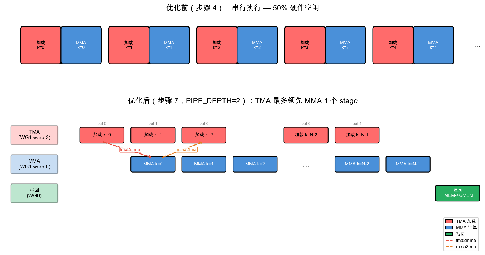
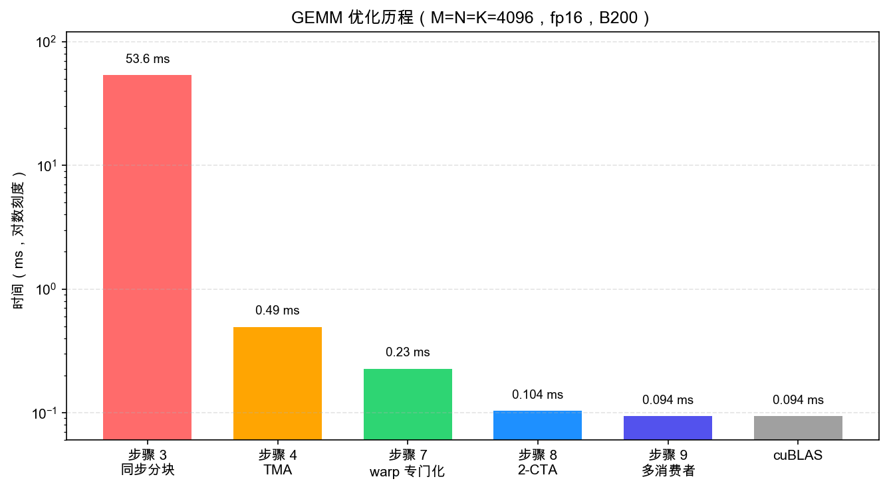

(zh_chap_gemm_advanced)=
# 用 Warp Specialization 和 Cluster 扩展 GEMM

:::{admonition} 概览
:class: overview

- pipelined GEMM 仍然让一个 warpgroup 按顺序做 load、MMA 和 writeback；本章会移除这个瓶颈。
- Step 7 把 warp 专门化为不同角色，Step 8 加入 2-CTA cluster，Step 9 加入多个 consumer。
- 每一步都会移除一个串行瓶颈，最终接近 state-of-the-art 吞吐。
:::

上一章的 pipelined GEMM（{ref}`zh_chap_gemm_async`）已经很快，但它仍然要求一个 warpgroup 做所有事情：
发射 load、运行 MMA，然后写回结果。即使用了 software pipeline，这一组 thread 仍然成为三个引擎的汇合点。

症状很容易看见。Tensor Core 运行时 TMA unit 安静下来；结果 drain 到内存时 Tensor Core 安静下来；
每个引擎都通过同一组 thread 等待其他引擎。越过这个问题的方法，是停止让一组 thread 做所有事情。

我们会通过三步逐渐扩大协作范围来追求这个想法。Step 7（{ref}`zh_chap_warp_specialization`）
把 warp 专门化为 producer、consumer 和 writeback 角色。Step 8（{ref}`zh_chap_cta_cluster`）
把两个 CTA 组成一个 cluster，并跨它们的 shared memory 共享 operand。Step 9（{ref}`zh_chap_multi_consumer`）
加入第二个 MMA consumer，让一个 staged tile 喂给两倍数学工作。

把这三步看作同一种 pattern 在不同尺度上的展开，会很有帮助。Step 7 把完整 pipeline 保持在一个 CTA 内部：
TMA 和 MMA 共享一个 warpgroup，而 writeback 在另一个 warpgroup 中运行。
Step 8 把协作扩大到 CTA 之间，产生一个跨越两个 CTA 的 256×256 tile。
Step 9 进一步提高 compute density：cluster output 增长到 512×256，每个 staged B tile 被两个 consumer 复用，
我们也到达教程中最密集的变体。

贯穿这一切，有一件事保持不变。SMEM、TMEM 和 register layout 仍然遵守前两章建立的 contract；
变化的是*谁协作*，而不是数据如何布局。Step 8 是协作 scope 第一次扩展到单个 CTA 之外，
因此它的 operand tile 会切分到两个 CTA 的 shared memory 中，一个 layout 会沿 `cbx` cluster axis 跨越两个 CTA。


(zh_chap_warp_specialization)=
## Step 7：Warp Specialization + Pipeline

single-warpgroup kernel 留下性能的原因很简单：每个 thread 走同一条路径，先 load，再 compute，再 write。
因此它在 loading 时，Tensor Core 无事可做；它在 computing 时，TMA engine 无事可做。
修复方式是 *warp specialization*。我们不再让一组 thread 轮流做每项工作，而是把每项工作交给专门的 warp，
并让这些 warp 同时运行，再由 software pipeline 缝合起来。这是 GEMM 路径中最大的架构变化，
本章剩余内容都建立在它之上。这里的 benchmark 使用 M=N=K=4096。

> **这一步改变什么：Scope**
> - Scope：一个 warpgroup 按顺序走 load → MMA → writeback，变成三个并发角色（TMA producer、MMA consumer、writeback），由 full/empty barrier 连接。
> - Layout：不变，与 Step 6 相同的 SMEM stage 和 TMEM accumulator。
> - Dispatch：不变，TMA load、`tcgen05` MMA。

**主题。**

- Warp specialization：把不同 warp/warpgroup 专门用于不同任务

- 高层 barrier 抽象：`TMABar`、`TCGen05Bar`、`MBarrier`

- `PipelineState` 用于自动 stage/phase 管理

- `warpgroup_sync` barrier ID 用于按 warpgroup 同步

（multi-stage SMEM pipeline 和 persistent `ClusterPersistentScheduler2D` 从 Step 5–6 原样复用；这里只新增 scope split。）

### 从顺序到并发

在介绍角色和 barrier 之前，先隔离 warp specialization 要移除的 scheduling bottleneck 会很有帮助。
下图用 Step-4 风格的 sequential timeline 作为 Step 4-6 中 specialization 前 kernel 的紧凑参考，
并把它放在 Step 7 warp-specialized schedule 上方，让 engine utilization 的差异一眼可见。



上方是 specialization 前的 single-warpgroup pattern：同一个未专门化的 thread group 同时拥有 load path 和 MMA path，
因此一个引擎活跃时，另一个引擎很容易闲置。Step 5 和 Step 6 用 double buffering 和 persistent scheduling 改进了这个 baseline，
但它们还没有把 loading 和 compute 分成独立 producer/consumer 角色。
下方的 specialization 打破了这种轮流执行。TMA producer 在 MMA consumer 忙于计算时 prefetch 下一个 tile，
writeback 则自行推进。producer warp 3 在 consumer warp 0 仍在处理当前 MMA 时发射下一次 load，
因此两个引擎都不必等待对方。load/MMA handoff 使用两个 barrier：

- **`tma2mma`**（TMA → MMA）：signal 已载入的 SMEM 数据已经 ready，可供 MMA 消费。
- **`mma2tma`**（MMA → TMA）：signal MMA 已经读完一个 buffer，因此 TMA 可以为下一次 load 复用它。

图中有个细节第一眼可能像错误：`mma2tma` 箭头会跨过一个 stage。原因是 ring buffer。
`PIPE_DEPTH=2` 时有两个 SMEM buffer，stage 0 和 stage 1；TMA Load k=0 填充 buffer 0，TMA Load k=1 填充 buffer 1。
当 MMA Compute k=0 读完 buffer 0 时，它 signal `mma2tma` 表示 buffer 空闲；
但真正想重新使用 buffer 0 的 load 是 TMA Load k=2，而不是 k=1（它使用 buffer 1）。
这就是为什么 MMA Compute k=0 的 `mma2tma` 箭头一路指向 TMA Load k=2。
release 跳过一个 stage，只是因为 ring 有两个 slot。

### Warp Roles

timeline 展示了我们*为什么*拆分工作；下一个问题是*谁*做每一部分。
specialization 把三个工作（load、compute、writeback）分配给特定 warp，让它们能同时运行。
当 `WG_NUMBER=2` 时，kernel 使用两个 warpgroup（角色表中缩写为 WG）：

| Actor | Location | Job |
|-------|----------|-----|
| **TMA Producer** | Warpgroup 1, warp 3 | 通过 TMA 持续 load A 和 B tile |
| **MMA Consumer** | Warpgroup 1, warp 0 | 数据 ready 后立即运行 MMA |
| **Writeback** | Warpgroup 0（全部 warp） | 读取 TMEM 结果，写入 GMEM |

### 4 个 Barrier

三个并发 actor 需要四个 barrier，而这四个 barrier 正好分成两个相反方向。
forward path（TMA → MMA → Writeback）signal 数据 *readiness*；它的信息是“你等的 tile 到了”。
backward path（Writeback → MMA → TMA）signal buffer *release*：“你想要的 slot 又空了”。
一旦知道命名约定，名字就能自己读懂：每个都是 `source2destination`，所以 `tma2mma`
就是 TMA signal MMA 的 barrier。

| Barrier | Type | Direction | Meaning |
|---------|------|-----------|---------|
| **tma2mma** | `TMABar` | TMA -> MMA | “SMEM data is ready” |
| **mma2tma** | `TCGen05Bar` | MMA -> TMA | “SMEM buffer can be reused” |
| **mma2ld** | `TCGen05Bar` | MMA -> Writeback | “TMEM results are ready” |
| **ld2mma** | `MBarrier` | Writeback -> MMA | “TMEM is free for next tile” |

为什么每个 barrier 会有它自己的 *type*？type 来自 producer 如何宣布自己完成。
**TMA Load** 使用 `TMABar`，即带 byte counting 的 mbarrier：当 transfer 的字节落地后，
TMA 硬件自己 arrive 到 barrier，因此 consumer 能知道数据 ready，而不需要任何 thread poll。
**TMA Store** 不能使用这个机制（store 没有人需要通知），所以它们退回到
`cp_async.bulk.commit_group()` + `wait_group(0)`，issuing thread 只是在等待自己的写入 drain。
**MMA operation** 使用 `TCGen05Bar`，当 MMA 完成时，`tcgen05.commit()` 指令会 signal 这个 barrier。

这里有一个小细节会在 Step 8 产生回报。`arrive` 调用传入 `cta_mask=0`，
因为在 single-CTA kernel 中没有其他 CTA 需要 signal。当 Step 8 形成 cluster 时，
这个参数会变成非零，并成为唤醒协作 CTA 的机制。

### PipelineState

四个 barrier 会告诉角色 buffer *何时* ready；但还需要有东西追踪 pipeline 循环时每个角色位于*哪个* buffer。
这正是 `PipelineState` 管理的 bookkeeping。ring buffer 同时携带两份 bookkeeping：
当前位于哪个 slot，以及正在等待这个 slot 的 barrier 的哪个 “phase”。
在 pipelined loop 中手动追踪二者，正是容易滋生 off-by-one 错误的事情；
这里的 off-by-one 会让整个 kernel deadlock。`PipelineState` 存在的目的就是把二者绑在一起，免得你手动管理：

```python
tma_ps = PipelineState(PIPE_DEPTH, phase=1)   # Producer starts ready (phase=1)
# tma_ps.stage = current stage index
# tma_ps.phase = current phase (0 or 1)
tma_ps.advance()                          # Advance to next stage
```

initial `phase` 会决定某个角色的第一次 `wait` 是让它运行，还是让它阻塞。
pipe 两端的正确答案正好相反，这就是容易绊倒人的地方：
- `phase=1`（producer）-> 第一次 `wait(phase=1)` 看到 barrier 仍在 phase 0；由于 0 != 1，它会**立即通过**。
  这正是我们想要的，因为 buffer 一开始是空的，producer 应该可以立刻开始填充。

- `phase=0`（consumer）-> 第一次 `wait(phase=0)` 看到 barrier 位于 phase 0；由于 0 == 0，它会**阻塞**。
  这同样是我们想要的，因为还没有数据，consumer 在 producer arrive 前没有东西可读。

如果给两端相同的 starting phase，你会得到 deadlock，或者更糟，silent corruption。
所以这个选择值得认真做对。

### `warpgroup_sync` Barrier IDs

specialization 引入了一个很容易踩到的同步危险。一旦每个 warpgroup 运行不同代码路径，
熟悉的 `cta_sync()` 就会 deadlock：它使用硬件 barrier #0，并要求*每个* CTA thread arrive；
但在 warpgroup branch 内，只有一部分 thread 存在。我们需要的是作用域为单个 warpgroup 的 barrier。
GPU 给了我们 16 个 named barrier（ID 0–15），所以 kernel 会使用 `warpgroup_sync(10)`，
它只同步一个 warpgroup 内的 thread。当多个 warpgroup 都需要各自同步时（multi-consumer Step 9 中就会这样），
它们通过 `warpgroup_sync(wg_id + 10)` 使用不同 ID，避免在同一个硬件 barrier 上碰撞。

**实现。**

这里使用 `PIPE_DEPTH=2`，这是仍然能让 load 和 compute overlap 的最小深度。
更深的 pipeline 可以隐藏更多内存延迟，直到 SMEM 预算限制为止；下面的 *When Step 7 misbehaves* 会详细讨论这个取舍。
现在所有部件都已具备（角色、四个 barrier、`PipelineState` 和 warpgroup-scoped sync），我们可以组装完整 kernel：

```python
import tvm
from tvm.script import tirx as T
from tvm.script.tirx import tile as Tx
from tvm.tirx.layout import TileLayout, S, TLane, TCol, tid_in_wg
from tvm.tirx.cuda.operator.tile_primitive.tma_utils import tma_shared_layout, SwizzleMode
from tvm.tirx.lang.pipeline import TMABar, TCGen05Bar, MBarrier, PipelineState
from tvm.tirx.lang.tile_scheduler import ClusterPersistentScheduler2D

SM_COUNT = 148  # Number of SMs on NVIDIA B200 GPU
F16_SIZE = 2

def hgemm_v7(M, N, K):
    a_type = tvm.DataType("float16")
    b_type = tvm.DataType("float16")
    d_type = tvm.DataType("float16")
    acc_type = tvm.DataType("float32")

    BLK_M, BLK_N, BLK_K = 128, 128, 64
    K_TILES = K // BLK_K
    PIPE_DEPTH = 2
    WG_NUMBER = 2

    A_layout = tma_shared_layout(a_type, SwizzleMode.SWIZZLE_128B_ATOM, (PIPE_DEPTH, BLK_M, BLK_K))
    B_layout = tma_shared_layout(b_type, SwizzleMode.SWIZZLE_128B_ATOM, (PIPE_DEPTH, BLK_N, BLK_K))
    D_layout = tma_shared_layout(d_type, SwizzleMode.SWIZZLE_128B_ATOM, (BLK_M, BLK_N))

    @T.prim_func
    def kernel(
        A: T.Buffer((M, K), a_type),
        B: T.Buffer((N, K), b_type),
        D: T.Buffer((M, N), d_type),
    ):
        T.device_entry()
        bx = T.cta_id([SM_COUNT])
        wg_id = T.warpgroup_id([WG_NUMBER])
        warp_id = T.warp_id_in_wg([4])
        lane_id = T.lane_id([32])

        # --- Allocation ---
        pool = T.SMEMPool()
        tmem_addr = pool.alloc((1,), "uint32")
        tma2mma = TMABar(pool, PIPE_DEPTH)
        mma2tma = TCGen05Bar(pool, PIPE_DEPTH)
        mma2ld  = TCGen05Bar(pool, 1)
        ld2mma  = MBarrier(pool, 1)
        pool.move_base_to(1024)
        Asmem = pool.alloc((PIPE_DEPTH, BLK_M, BLK_K), a_type, layout=A_layout)
        Bsmem = pool.alloc((PIPE_DEPTH, BLK_N, BLK_K), b_type, layout=B_layout)
        Dsmem = pool.alloc((BLK_M, BLK_N), d_type, layout=D_layout)

        # --- Barrier init ---
        tma2mma.init(1)
        mma2tma.init(1)
        mma2ld.init(1)
        ld2mma.init(128)   # all 128 Warpgroup 0 threads arrive
        pool.commit()

        # --- TMEM alloc + fence ---
        if wg_id == 0:
            if warp_id == 0:
                T.ptx.tcgen05.alloc(T.address_of(tmem_addr), n_cols=512, cta_group=1)
        T.ptx.fence.proxy_async("shared::cta")
        T.ptx.fence.mbarrier_init()
        T.cuda.cta_sync()

        tmem = T.decl_buffer(
            (128, 512), acc_type, scope="tmem", allocated_addr=tmem_addr[0],
            layout=TileLayout(S[(128, 512) : (1@TLane, 1@TCol)]))

        # --- Tile scheduler ---
        tile_scheduler = ClusterPersistentScheduler2D(
            "ts", num_m_tiles=M // BLK_M, num_n_tiles=N // BLK_N,
            l2_group_size=8, num_clusters=SM_COUNT)
        tile_scheduler.init(bx)
        m_st = T.meta_var(tile_scheduler.m_idx * BLK_M)
        n_st = T.meta_var(tile_scheduler.n_idx * BLK_N)

        # =============================================
        # Warpgroup 1: TMA Producer (warp 3) + MMA Consumer (warp 0)
        # =============================================
        if wg_id == 1:
            if warp_id == 3:
                # === TMA Producer ===
                tma_ps = PipelineState(PIPE_DEPTH, phase=1)

                @T.inline
                def tma_load(k_offset):
                    Tx.copy_async(Asmem[tma_ps.stage, :, :],
                                  A[m_st:m_st+BLK_M, k_offset:k_offset+BLK_K],
                                  dispatch="tma", cta_group=1,
                                  mbar=tma2mma.ptr_to([tma_ps.stage]))
                    Tx.copy_async(Bsmem[tma_ps.stage, :, :],
                                  B[n_st:n_st+BLK_N, k_offset:k_offset+BLK_K],
                                  dispatch="tma", cta_group=1,
                                  mbar=tma2mma.ptr_to([tma_ps.stage]))

                if T.filter(lane_id, T.ptx.elect_sync()):
                    while tile_scheduler.valid():
                        for k in range(K_TILES):
                            mma2tma.wait(tma_ps.stage, tma_ps.phase)
                            tma_load(k * BLK_K)
                            tma2mma.arrive(tma_ps.stage,
                                           (BLK_M * BLK_K + BLK_N * BLK_K) * F16_SIZE)
                            tma_ps.advance()
                        tile_scheduler.next_tile()

            elif warp_id == 0:
                # === MMA Consumer ===
                mma_ps = PipelineState(PIPE_DEPTH, phase=0)
                ld_ps = PipelineState(1, phase=1)

                if T.filter(lane_id, T.ptx.elect_sync()):
                    while tile_scheduler.valid():
                        # Wait for TMEM to be free from previous tile's writeback
                        ld2mma.wait(ld_ps.stage, ld_ps.phase)
                        ld_ps.advance()

                        for k in range(K_TILES):
                            tma2mma.wait(mma_ps.stage, mma_ps.phase)
                            Tx.gemm_async(
                                tmem[:, :BLK_N],
                                Asmem[mma_ps.stage, :, :],
                                Bsmem[mma_ps.stage, :, :],
                                accum=(k != 0), dispatch="tcgen05", cta_group=1)
                            mma2tma.arrive(mma_ps.stage, cta_group=1, cta_mask=0)
                            mma_ps.advance()

                        # Signal results ready for writeback
                        mma2ld.arrive(0, cta_group=1, cta_mask=0)
                        tile_scheduler.next_tile()

        # =============================================
        # Warpgroup 0: Writeback
        # =============================================
        elif wg_id == 0:
            wb_ps = PipelineState(1, phase=0)
            reg_f16 = T.alloc_local((BLK_N,), d_type)

            while tile_scheduler.valid():
                # Wait for MMA results
                mma2ld.wait(wb_ps.stage, wb_ps.phase)
                wb_ps.advance()

                # Read TMEM -> registers (warpgroup scope)
                reg = T.alloc_local((BLK_N,), acc_type)
                reg_wg = reg.view(128, BLK_N,
                    layout=TileLayout(S[(128, BLK_N) : (1@tid_in_wg, 1)]))
                Tx.wg.copy_async(reg_wg[:], tmem[:, :BLK_N])
                T.ptx.tcgen05.wait.ld()

                # Signal TMEM free (all 128 threads arrive)
                ld2mma.arrive(0, cta_id=0, pred=True)

                # Cast fp32 -> fp16
                Tx.cast(reg_f16[:], reg[:])

                # Write to Dsmem + TMA store
                Tx.copy(Dsmem[warp_id * 32 + lane_id, :], reg_f16[:])
                T.ptx.fence.proxy_async("shared::cta")
                T.cuda.warpgroup_sync(10)
                if warp_id == 0:
                    if lane_id == 0:
                        Tx.copy_async(D[m_st:m_st+BLK_M, n_st:n_st+BLK_N],
                                      Dsmem[:, :], dispatch="tma")
                        T.ptx.cp_async.bulk.commit_group()
                        T.ptx.cp_async.bulk.wait_group(0)
                T.cuda.warpgroup_sync(10)

                tile_scheduler.next_tile()

        # --- Cleanup ---
        T.cuda.cta_sync()
        if warp_id == 0:
            T.ptx.tcgen05.relinquish_alloc_permit(cta_group=1)
            T.ptx.tcgen05.dealloc(tmem_addr[0], n_cols=512, cta_group=1)

    return kernel
```

要运行这些 kernel 中的任意一个，可以复用我们在 Step 1（{ref}`zh_chap_gemm_basics`）中展示过的 compile / run / check harness：把 `hgemm_v1` 换成 `hgemm_v7`、`hgemm_v8` 或 `hgemm_v9`，并选择例如 `M=N=K=4096` 的问题规模。注意，cluster 版本要求 `M` 和 `N` 是 cluster tile 的倍数（Step 8 为 `256×256`，Step 9 为 `512×256`），因此很小的 `128×128` 规模根本不会产生 tile。每个 step 请在全新的 Python session 中单独编译，切换 step 前重启 kernel，因为这些 kernel 会复用内部名字，而编译器会保留 session 内状态。各 step 的计时汇总在下面的 *End-to-End Result* 中。

### Epilogue（Writeback）细节

Step 7 的 epilogue 可以相当简单。因为只有 `BLK_N=128` 列，writeback warpgroup 能一次性把整个 TMEM tile 读入寄存器，然后发起一次 TMA store。Step 8 和 Step 9 就没有这个余裕了，所以后面会引入 chunking；但现在流程是：

1. 等待 MMA：`mma2ld.wait(phase)`。本教程中的 Step 8 和 Step 9 会在这里额外加一个保守的 `fence.after_thread_sync()`；MMA-completion mbarrier 已经覆盖了顺序保证，大多数 kernel（包括 CUTLASS）都会省略它，所以 Step 7 也省略。
2. 读取 TMEM -> registers（每个线程 128 个 fp32；warpgroup scope 下通过 `Tx.copy_async(reg_wg, tmem[:, :BLK_N])`，随后 `T.ptx.tcgen05.wait.ld()`）。
3. 通知 MMA：`ld2mma.arrive(0, cta_id=0, pred=True)`（全部 128 个线程 arrive）；此时 TMEM 可以被下一个 tile 复用。这两个 `arrive` kwargs 在 cluster 版本中会再次出现：`cta_id` 表示要 signal *哪个 CTA 的* barrier 副本（`0` = 本 CTA，也就是 local barrier；Step 8 的 cooperative arrive 会改用 `cta_mask` 指向 CTA-0），`pred` 是逐线程谓词，用来决定该线程是否真的 arrive（这里是 `True`，所以每个 writeback 线程都会计入 arrival 总数）。
4. 在寄存器中把 fp32 转成 fp16。
5. 写 registers -> Dsmem，然后用 `fence.proxy_async("shared::cta") + warpgroup_sync(10)` 刷新。
6. 通过 `cp_async.bulk.commit_group() + wait_group(0)` 做 TMA store，把 Dsmem 写回 GMEM。

Step 8（`BLK_N=256`）和 Step 9（每个 consumer 的 `MMA_N=256`）不能继续保持这种一次性形式，原因是寄存器压力。每个线程读取 256 个 fp32 值，意味着 256 × 4 = 1024 字节必须同时驻留在该线程寄存器中，这有溢出到 local memory 的风险；同时还会迫使 Dsmem buffer 变大。因此这些 step 会把 writeback 拆成 `EPI_N` 列的 chunk（`EPI_N=64`）：每次 iteration 只保留 `EPI_N` 个 fp32 寄存器值，并发起一个相应更小的 TMA store，用少量额外 store 指令换取更舒服的寄存器预算。

**实现说明。**

- **Persistent kernel**：`bx = T.cta_id([SM_COUNT])` --- 每个 SM 一个 CTA，在 tile 上循环

- **L2-friendly scheduling**：`ClusterPersistentScheduler2D` 按有利于 cache locality 的顺序安排 tile

- 这种模式 --- warp specialization 加 software pipelining --- 在高性能 GEMM kernel 中很常见，包括 CUTLASS 风格的设计。

### Step 7 行为异常时

Step 7 是第一个让 TMA load、`tcgen05` MMA 和 writeback 同时在路上的 GEMM kernel。Step 8 和 Step 9 会反复遇到同样的失败模式：barrier 计数不匹配、role guard 放错位置、缺少 fence，或 TMA store 还没 drain 就复用了 staging buffer。这类问题的调试清单汇总在 {ref}`zh_chap_warp_spec_debug`。

**Pipeline depth 调优。** Step 7 kernel 使用最小的 `PIPE_DEPTH=2`。把它推到 4 或 6，可以让 TMA producer 领先 MMA consumer 更远，从而隐藏更多内存延迟；但代价是消耗更多 SMEM，而 SMEM 是有限的。B200 每个 SM 提供 228 KB（见 {ref}`zh_chap_background` 中的 *Numbers to Keep in Mind*）。在 `BLK_M=BLK_N=128, BLK_K=64, fp16` 下，每个 pipeline stage 中 A 和 B 合计消耗 `(128*64 + 128*64) * 2 = 32 KB`，`Dsmem` writeback staging buffer 还要再加 32 KB。因此 `PIPE_DEPTH=4` 大约是 160 KB，`PIPE_DEPTH=6` 大约是 224 KB，已经贴近预算上限。想再深入，就必须重新设计 writeback staging 策略。

---

warp specialization 让一个 CTA 内的线程协作起来。下一步会把这种协作扩展到 CTA 边界之外，让两个 CTA 共同处理一个更大的 tile。


(zh_chap_cta_cluster)=
## Step 8: 2-CTA Cluster

Step 7 让各个引擎开始重叠，但每个 CTA 仍然孤立地计算自己的 128×128 tile，重新加载邻居无法借用的 operand。Step 8 打破这种隔离。两个 CTA 组成一个 cluster，并获得访问彼此 shared memory 的能力；于是单个 cooperative `tcgen05` MMA 可以产生一个横跨两者的 256×256 tile，而一次 B 加载现在能喂给两倍的 MMA 工作。和前面一样，M=N=K=4096。

> **这个 step 改变了什么：Scope + Layout + Dispatch**
> - Scope：协作 scope 现在跨越 cluster 中的两个 CTA，而不是一个。
> - Layout：operand tile 被拆分到两个 CTA 的 SMEM 中；CTA 0 拥有共享的 completion barrier（`remote_view`）。
> - Dispatch：MMA 增加 `cta_group` / `cta_mask`，让 `tcgen05` 以 2-CTA cooperative op 运行。

**主题。**

- CTA cluster：多个 CTA 在一个更大的 tile 上协作

- 通过 `map_shared_rank` 进行 cross-CTA SMEM 访问

- 在 256x256 cluster tile 上使用 `cta_group=2` 执行 cooperative MMA

- 使用 `cta_mask` 做 cross-CTA barrier signaling


### Cluster Tile 形状

整个优化建立在一个硬件能力上：使用 `cta_group=2` 时，MMA 可以读取 *两个* CTA staged 的 operand tile，而不仅是自己所在 CTA 的 tile。每个 CTA 加载 stored B 的一个 128 行切片；转置后，它会变成 128 个逻辑输出列；cooperative MMA 再把两个切片缝合回一个 operand。下图追踪两个 CTA 的 A/B 切片如何合并成单个 256×256 cluster tile：

```{raw} html
<div style="overflow-x:auto;">
<iframe src="../demo/cta_cluster.html" title="A 2-CTA cluster: cooperative MMA via cross-CTA SMEM read" loading="lazy"
        style="width:100%; min-width:720px; height:580px; border:1px solid var(--pst-color-border, #d0d0d0); border-radius:6px;"></iframe>
</div>
```
*交互图：每个 CTA 拥有一个 A 行切片和一个 stored-B 行切片，然后通过 cluster（DSMEM）读取另一个 CTA 的 stored-B 切片。经过 `B.T` 后，两个 stored-B 切片覆盖完整的输出列范围，因此这对 CTA 产生一个 256×256 输出 tile。*

**为什么 A 和 B 要跨 cluster 拆分**：要看清 256×256 tile 如何分区，先回忆本教程把 GEMM 写成 `D = A @ B.T`，其中 stored B 的形状是 `N x K`。有两个 CTA 在一个 cluster 中时，拆分方式非常自然：

- **A 竖向拆分**：CTA-0 持有 A0（行 0-127），CTA-1 持有 A1（行 128-255）。堆叠后是 `[A0; A1]`（256 行）。
- **Stored B 按行拆分**：CTA-0 加载 B 行 0-127，CTA-1 加载 B 行 128-255。因为数学上使用 `B.T`，这两个 stored row slice 会变成逻辑右操作数的两个 128 列切片。
- 使用 `cta_group=2` 时，MMA 硬件通过 cross-CTA shared memory access 从 **两个** CTA 的 SMEM 中读取 B，因此它能看到完整的逻辑输出列范围。
- 结果：两个 CTA 协作处理一个 256x256 输出 tile。每个 CTA 写出这个 tile 的一个 128x256 行条带。

这里值得停一下，看看为什么这是真正的收益，而不只是重新洗牌。每个 CTA 仍然只加载 128×K 的 A 和 128×K 的 B，因此整个 cluster staged operand 约为单个 CTA 的 2×；但它产生的是 256×256 tile，输出 FLOP 大约是 128×128 tile 的 4×。因此每个 staged-operand byte 对应的 MMA 工作量约翻倍，因为每个 CTA 的 B 切片会通过 cooperative MMA 与另一个 CTA 的 A 切片复用。换句话说，arithmetic intensity 大约翻倍，而这正是仍偏 memory-bound 的 kernel 所需要的杠杆：End-to-End 表中约 2.2× 的加速来自让同一批字节服务更多数学计算。

### Tile 地址计算

现在 cluster 成了工作单元，tile scheduler 也必须按 cluster tile 计数。它返回的每个 `(m_idx, n_idx)` 都表示一个完整的 256×256 区域，cluster 内的两个 CTA 会共同拆分这个区域。把 cluster 坐标转换成每个 CTA 实际加载的 per-CTA slice，形式如下：

```python
m_st = (m_idx * CTA_GROUP + cbx) * BLK_M
n_st = (n_idx * CTA_GROUP + cbx) * BLK_N
```

两个 CTA 处理的是 *同一个* 256×256 cluster tile；单个坐标 `cbx`（该 CTA 在 cluster 内的位置，0 或 1）会在两个轴上选出这个 CTA 的贡献。`m_st` 选择该 CTA 拥有的输出行条带，`n_st` 选择它喂给 cooperative MMA 的 stored-B 切片，writeback 随后会写出 256 列输出范围的两个 128 列半块。还要注意，`num_m_tiles = M // 256` 和 `num_n_tiles = N // 256` 计数的是 cluster tile，而不是单个 CTA tile。

乍看之下，`cbx` 同时出现在 `m_st` 和 `n_st` 中，好像一个行偏移泄漏到了列上；但两个用法都是正确的，值得拆开看。在 writeback 路径上，`cbx` 只属于 M 轴：每个 CTA 拥有不同的 128 行条带（`m_st = (m_idx * CTA_GROUP + cbx) * BLK_M`，因此 CTA-0 写 `m_idx*256 .. +128` 行，CTA-1 写接下来的 128 行），但两个 CTA 都会写 cluster tile 的 *完整* 256 个输出列。这也正是 store 的列坐标来自 cluster 的 `n_idx`（`n_st_epi = n_idx * 256 + no * 128`，完全没有 `cbx`），而不是 per-CTA `n_st` 的原因。`n_st` 之所以带着 `cbx`，是因为每个 CTA 会把不同的 stored-B 行切片加载进 MMA：在那里，`cbx` 是一个 *load* offset，而不是该 CTA 的输出列偏移。

### 相比 Step 7 的代码变化

相对 Step 7 的 diff 有六处改动，每一处都编码了刚才描述的 cluster contract 中的一个部分：

```python
# 1. Cluster launch
cbx, cby = T.cta_id_in_cluster([CTA_GROUP, 1])   # cbx = CTA index within cluster (0 or 1)

# 2. Cooperative MMA (was cta_group=1)
Tx.gemm_async(..., cta_group=2)

# 3. Cross-CTA shared memory access
B_remote = T.ptx.map_shared_rank(Bsmem, cta_id=1)

# 4. Cross-CTA barrier
tma2mma_cta0 = T.decl_buffer(
    [CTA_GROUP], "uint64",
    data=T.ptx.map_shared_rank(tma2mma.ptr_to([0]), 0),
    scope="shared"
)

# 5. mma2tma / mma2ld arrives go from cta_mask=0 (single CTA, Step 7)
#    to cta_mask=3 (signal both CTAs in the cluster)
mma2tma.arrive(mma_ps.stage, cta_group=CTA_GROUP, cta_mask=3)
mma2ld.arrive(0, cta_group=CTA_GROUP, cta_mask=3)

# 6. Cluster sync replaces cta_sync at the end
T.cuda.cluster_sync()
```


### Cluster-Scope 变化

这六处改动都源自同一个转变：协作 scope 现在是 cluster，而不是单个 CTA。下面几点说明这种扩展在实践中意味着什么：每个 CTA 如何找到自己的位置、cluster 以谁的 barrier 作为协调点，以及究竟哪个 CTA 发出 cooperative MMA。

- **Cluster CTA ID**：`cbx` 告诉每个 CTA 它在 cluster 中的位置（0 或 1）。CTA-0 处理 A 行 0-127，CTA-1 处理行 128-255。

- **Remote barrier view**：在 cluster 中，每个 CTA 都有自己的 SMEM 和自己的 barrier，这带来一个自然问题：如果 CTA-1 需要等待 CTA-0 产生的东西，它实际应该碰谁的 barrier？答案是指定 CTA-0 的 barrier 作为唯一协调点，并允许 cluster 中任意 CTA 访问它们。`map_shared_rank(tma2mma.ptr_to([0]), 0)` 会返回指向 CTA-0 barrier 的 cluster-wide pointer；TIRx wrapper 是 `tma2mma.remote_view(0)`。从那以后，每次 arrive 和 wait 都指向 CTA-0 的副本。

- **MMA 只从 CTA-0 dispatch**：很容易把 `cta_group=2` 理解成并行发射两个引擎，但事实不是这样。CTA-0 只发出一个 `tcgen05.mma`，然后硬件驱动一个跨越两个 CTA 的 *单个 cooperative* MMA：它从两个 SM 的 SMEM 中读取 operand，并把 accumulator 写到两个 SM 的 TMEM 中。CTA-1 完全不发出 MMA。（每个 SM 只有一个 `tcgen05` 引擎，所以 `cta_group=2` 是一次 cross-SM MMA，不是两个引擎并排运行。）这就是代码用 `if cbx == 0:` guard MMA 的原因。

- **Multicast arrive**：`tcgen05.commit(..., cta_group=2, cta_mask=3)` 只由 CTA-0 发出，但会 signal 两个 CTA 的 barrier。`cta_mask=3`（二进制 `11`）表示目标包含 CTA-0 和 CTA-1。

- **ld2mma init count**：`init(128 * CTA_GROUP)` --- 两个 CTA 的 writeback warpgroup（各 128 个线程）都会 arrive。


**实现。**

```python
def hgemm_v8(M, N, K):
    a_type = tvm.DataType("float16")
    b_type = tvm.DataType("float16")
    d_type = tvm.DataType("float16")
    acc_type = tvm.DataType("float32")

    CTA_GROUP = 2
    BLK_M, BLK_N, BLK_K = 128, 128, 64
    MMA_M, MMA_N = 256, 256
    K_TILES = K // BLK_K
    PIPE_DEPTH = 4
    WG_NUMBER = 2
    F16_SIZE = 2  # fp16

    A_layout = tma_shared_layout(a_type, SwizzleMode.SWIZZLE_128B_ATOM, (PIPE_DEPTH, BLK_M, BLK_K))
    B_layout = tma_shared_layout(b_type, SwizzleMode.SWIZZLE_128B_ATOM, (PIPE_DEPTH, BLK_N, BLK_K))
    D_layout = tma_shared_layout(d_type, SwizzleMode.SWIZZLE_128B_ATOM, (BLK_M, 128))

    @T.prim_func
    def kernel(
        A: T.Buffer((M, K), a_type),
        B: T.Buffer((N, K), b_type),
        D: T.Buffer((M, N), d_type),
    ):
        T.device_entry()
        bx = T.cta_id([SM_COUNT])
        cbx, cby = T.cta_id_in_cluster([CTA_GROUP, 1])
        wg_id = T.warpgroup_id([WG_NUMBER])
        warp_id = T.warp_id_in_wg([4])
        lane_id = T.lane_id([32])

        # --- Allocation ---
        pool = T.SMEMPool()
        tmem_addr = pool.alloc((1,), "uint32")
        tma2mma = TMABar(pool, PIPE_DEPTH)
        mma2tma = TCGen05Bar(pool, PIPE_DEPTH)
        mma2ld  = TCGen05Bar(pool, 1)
        ld2mma  = MBarrier(pool, 1)
        pool.move_base_to(1024)
        Asmem = pool.alloc((PIPE_DEPTH, BLK_M, BLK_K), a_type, layout=A_layout)
        Bsmem = pool.alloc((PIPE_DEPTH, BLK_N, BLK_K), b_type, layout=B_layout)
        Dsmem = pool.alloc((BLK_M, 128), d_type, layout=D_layout)

        # --- Barrier init ---
        tma2mma.init(1)
        mma2tma.init(1)
        mma2ld.init(1)
        ld2mma.init(128 * CTA_GROUP)  # both CTAs' writeback threads
        pool.commit()

        # --- TMEM alloc (cooperative) ---
        if wg_id == 0:
            if warp_id == 0:
                T.ptx.tcgen05.alloc(T.address_of(tmem_addr), n_cols=512, cta_group=CTA_GROUP)
        T.ptx.fence.proxy_async("shared::cta")
        T.ptx.fence.mbarrier_init()
        T.cuda.cta_sync()

        tmem = T.decl_buffer(
            (128, 512), acc_type, scope="tmem", allocated_addr=tmem_addr[0],
            layout=TileLayout(S[(128, 512) : (1@TLane, 1@TCol)]))

        # --- Tile scheduler (cluster tiles) ---
        tile_scheduler = ClusterPersistentScheduler2D(
            "ts", num_m_tiles=M // 256, num_n_tiles=N // 256,
            l2_group_size=8, num_clusters=SM_COUNT // CTA_GROUP)
        tile_scheduler.init(bx // CTA_GROUP)
        m_idx = T.meta_var(tile_scheduler.m_idx)
        n_idx = T.meta_var(tile_scheduler.n_idx)
        m_st = T.meta_var((m_idx * CTA_GROUP + cbx) * BLK_M)
        n_st = T.meta_var((n_idx * CTA_GROUP + cbx) * BLK_N)

        # --- Cross-CTA barrier view ---
        tma2mma_cta0 = tma2mma.remote_view(0)

        # =============================================
        # Warpgroup 1: TMA Producer (warp 3) + MMA Consumer (warp 0)
        # =============================================
        if wg_id == 1:
            if warp_id == 3:
                tma_ps = PipelineState(PIPE_DEPTH, phase=1)

                @T.inline
                def tma_load(k_offset):
                    Tx.copy_async(Asmem[tma_ps.stage, :, :],
                                  A[m_st:m_st+BLK_M, k_offset:k_offset+BLK_K],
                                  dispatch="tma", cta_group=CTA_GROUP,
                                  mbar=tma2mma_cta0.ptr_to([tma_ps.stage]))
                    Tx.copy_async(Bsmem[tma_ps.stage, :, :],
                                  B[n_st:n_st+BLK_N, k_offset:k_offset+BLK_K],
                                  dispatch="tma", cta_group=CTA_GROUP,
                                  mbar=tma2mma_cta0.ptr_to([tma_ps.stage]))

                if T.filter(lane_id, T.ptx.elect_sync()):
                    while tile_scheduler.valid():
                        for k in range(K_TILES):
                            mma2tma.wait(tma_ps.stage, tma_ps.phase)
                            tma_load(k * BLK_K)
                            if cbx == 0:
                                tma2mma_cta0.arrive(tma_ps.stage,
                                    CTA_GROUP * (BLK_M * BLK_K + BLK_N * BLK_K) * F16_SIZE)
                            tma_ps.advance()
                        tile_scheduler.next_tile()

            elif warp_id == 0:
                mma_ps = PipelineState(PIPE_DEPTH, phase=0)
                ld_ps = PipelineState(1, phase=1)

                if cbx == 0:
                    if T.filter(lane_id, T.ptx.elect_sync()):
                        while tile_scheduler.valid():
                            ld2mma.wait(ld_ps.stage, ld_ps.phase)
                            ld_ps.advance()

                            for k in range(K_TILES):
                                tma2mma.wait(mma_ps.stage, mma_ps.phase)
                                Tx.gemm_async(
                                    tmem[:, :MMA_N],
                                    Asmem[mma_ps.stage, :, :],
                                    Bsmem[mma_ps.stage, :, :],
                                    accum=(k != 0), dispatch="tcgen05", cta_group=CTA_GROUP)
                                mma2tma.arrive(mma_ps.stage, cta_group=CTA_GROUP, cta_mask=3)
                                mma_ps.advance()

                            mma2ld.arrive(0, cta_group=CTA_GROUP, cta_mask=3)
                            tile_scheduler.next_tile()

        # =============================================
        # Warpgroup 0: Writeback (256 columns in 2 x 128-column chunks)
        # =============================================
        elif wg_id == 0:
            wb_ps = PipelineState(1, phase=0)
            reg_f16 = T.alloc_local((128,), d_type)

            while tile_scheduler.valid():
                mma2ld.wait(wb_ps.stage, wb_ps.phase)
                wb_ps.advance()
                T.ptx.tcgen05.fence.after_thread_sync()

                for no in T.unroll(2):  # 2 chunks of 128 columns = 256 total
                    reg = T.alloc_local((128,), acc_type)
                    reg_wg = reg.view(128, 128,
                        layout=TileLayout(S[(128, 128) : (1@tid_in_wg, 1)]))
                    Tx.wg.copy_async(reg_wg[:], tmem[:, no * 128:(no + 1) * 128])
                    T.ptx.tcgen05.wait.ld()
                    Tx.cast(reg_f16[:], reg[:])
                    Tx.copy(Dsmem[warp_id * 32 + lane_id, :], reg_f16[:])
                    T.ptx.fence.proxy_async("shared::cta")
                    T.cuda.warpgroup_sync(10)
                    if warp_id == 0:
                        if lane_id == 0:
                            n_st_epi = T.meta_var(n_idx * 256 + no * 128)
                            Tx.copy_async(D[m_st:m_st+BLK_M, n_st_epi:n_st_epi+128],
                                          Dsmem[:, :], dispatch="tma")
                            T.ptx.cp_async.bulk.commit_group()
                            T.ptx.cp_async.bulk.wait_group(0)
                    T.cuda.warpgroup_sync(10)

                ld2mma.arrive(0, cta_id=0, pred=True)
                tile_scheduler.next_tile()

        # --- Cleanup ---
        T.cuda.cluster_sync()
        if warp_id == 0:
            T.ptx.tcgen05.relinquish_alloc_permit(cta_group=CTA_GROUP)
            T.ptx.tcgen05.dealloc(tmem_addr[0], n_cols=512, cta_group=CTA_GROUP)

    return kernel
```

**2 个 CTA 带来的变化。**

- `CTA_GROUP = 2`, `MMA_N = BLK_N * CTA_GROUP = 256`

- `ld2mma.init(128 * CTA_GROUP)` --- 两个 CTA 的 writeback WG 都会 arrive

- TMA arrive 字节数包含两个 CTA：`CTA_GROUP * (BLK_M * BLK_K + BLK_N * BLK_K) * F16_SIZE`

- `tcgen05.alloc` 和 `tcgen05.dealloc` 必须使用 `cta_group=2`

- Writeback 会把 256 个输出列拆成两个 128 列 chunk --- 一次读取全部 256 个 TMEM 列会超过寄存器容量。Step 9 会进一步把 chunk 缩小到 `EPI_N=64`

- 末尾用 `cluster_sync()` 替换 `cta_sync()`（确保 TMEM dealloc 前所有 CTA 都已完成）

额外的 arithmetic intensity 会直接体现在墙钟时间上：Step 8 在 4096³ 下达到 **0.104 ms**，相比相同规模下 70 ms 的 Step-1 算法约快 676×（见 End-to-End 表）。这个 kernel 现在已经开始偏向 compute-bound，这正好为 Step 9 铺路：我们会加入第二个 MMA consumer，让更多 Tensor Core 工作保持在飞行中。

如果 Step 8 反而比 Step 7 *更慢*，问题几乎总是某个新的 cluster contract 写偏了。优先检查三件事：TMA arrive byte count 是否为 `CTA_GROUP * (BLK_M*BLK_K + BLK_N*BLK_K) * F16_SIZE`；256×256 cluster tile 对应的 scheduler 维度是否是 `num_m_tiles=M//256, num_n_tiles=N//256`；writeback 是否确实发起两次 TMA store（每个 128 列 chunk 一次），且每次都在 Dsmem 复用前 drain 完。

---

Cluster 提升的是 CTA *之间* 的复用。最后一步转向内部：给 producer 再配一个 MMA consumer，让每个 CTA *内部* 的计算密度更高。


(zh_chap_multi_consumer)=
## Step 9: Multi-Consumer Warp Specialization

到 Step 8，MMA 已经真正忙起来了；但单个 consumer warp 消化 staged B tile 的速度毕竟有限，而这块 B tile 一直待在 SMEM 中，任何愿意读取它的角色都能复用。最后一个优化正是利用这一点：加入第二个 MMA consumer，用 *不同的* A block 乘同一个 B tile。每个 CTA 的计算密度翻倍，cluster 输出从 256×256 增长到 512×256。和前面一样，M=N=K=4096。

> **这个 step 改变了什么：Scope + Layout**
> - Scope：一个 MMA consumer 变成两个，由 `warp_id` 选择。
> - Layout：同一个 staged B tile 被两个 consumer 复用；A 增加一个 consumer 轴。
> - Dispatch：不变。

**主题。**

- 多个 MMA warp（consumer）以获得更高吞吐

- 多个 writeback warpgroup，各自拥有独立 barrier slot

- 本教程中最高优化 GEMM 变体使用的结构


### Multi-Consumer 结构

加入第二个 consumer 意味着 kernel 现在需要安排更多独立角色：两个 MMA warp，而不是一个；再配一个第二 writeback warpgroup，用来 drain 额外的 accumulator。在 `NUM_CONSUMER=2` 且 `WG_NUMBER=3` 时，kernel 现在横跨三个 warpgroup（角色表中缩写为 WG）：

| Warpgroup | Warp | 角色 |
|-----------|------|------|
| **WG 2** | warp 0 | MMA consumer 0：`Asmem[..., 0] x B` -> TMEM cols `[0:256]` |
| **WG 2** | warp 1 | MMA consumer 1：`Asmem[..., 1] x B` -> TMEM cols `[256:512]` |
| **WG 2** | warp 3 | TMA producer：每个 stage 加载 2x A block + 1x B block |
| **WG 0** | all | consumer 0 的 writeback：读取 TMEM `[0:256]` |
| **WG 1** | all | consumer 1 的 writeback：读取 TMEM `[256:512]` |

整个安排依赖一个不对称性。每个 consumer 都用自己的 A block 去乘 *同一个* staged B tile，因此一次 B 加载现在能喂给 2× 的 MMA 工作，B 在每个有效 FLOP 上的加载成本等效减半。我们共享 B 而不是 A，是因为两个 consumer 覆盖不同的 M 行条带：它们的 A block 确实是不同数据，而 B 对两者完全相同。练习 3 会让你说服自己：这是唯一可行的共享方式。

### 相比 Step 8 的变化

具体来说，支持第二个 consumer 会触碰 kernel 中的几个地方，而每处变化都可以追溯到同一个事实：每个 stage 现在要喂给并 drain 两个 A block 和两个 TMEM range，而 B 保持共享。下面这些修改会额外 stage 一个 A block，给每个 consumer 自己的 barrier slot，并为更高的 512×256 cluster tile 调整 tile addressing。

- `Asmem = pool.alloc((PIPE_DEPTH, NUM_CONSUMER, BLK_M, BLK_K), ...)` --- 每个 stage 有 2 个 A block，每个 consumer 一个

- TMA 同时加载 `Asmem[stage, 0]` 和 `Asmem[stage, 1]`，TMA arrive bytes 现在是 `CTA_GROUP * (NUM_CONSUMER * BLK_M * BLK_K + BLK_N * BLK_K) * F16_SIZE`（多了一个 A block）

- MMA warp 用 `warp_id` 选择哪个 A block 和哪个 TMEM range

- `mma2tma.init(NUM_CONSUMER)` --- 每个 stage 中两个 consumer 都会 signal TMA

- `mma2ld` 和 `ld2mma` 都有 `depth=NUM_CONSUMER` --- 每个 consumer 使用自己的 barrier slot（MMA 侧用 `warp_id`，writeback 侧用 `wg_id`）

- Tile 地址：`m_st = (m_idx * NUM_CONSUMER * CTA_GROUP + cbx) * BLK_M` --- M 方向多了一个 `NUM_CONSUMER` 因子，因为每个 cluster tile 现在在 M 方向跨越 `NUM_CONSUMER` 个 consumer。Tile scheduler 使用 `num_m_tiles = M // 256 // NUM_CONSUMER`（cluster tile 为 512x256）

- Writeback 使用分块的 `EPI_N`，让每次 iteration 中活跃在寄存器里的 TMEM-readback 值更少


**实现。**

```python
def hgemm_v9(M, N, K):
    a_type = tvm.DataType("float16")
    b_type = tvm.DataType("float16")
    d_type = tvm.DataType("float16")
    acc_type = tvm.DataType("float32")

    CTA_GROUP = 2
    NUM_CONSUMER = 2
    BLK_M, BLK_N, BLK_K = 128, 128, 64
    MMA_N = BLK_N * CTA_GROUP   # 256
    K_TILES = K // BLK_K
    PIPE_DEPTH = 4
    EPI_N = 64
    WG_NUMBER = 3
    F16_SIZE = 2  # fp16

    A_layout = tma_shared_layout(a_type, SwizzleMode.SWIZZLE_128B_ATOM,
                                 (PIPE_DEPTH, NUM_CONSUMER, BLK_M, BLK_K))
    B_layout = tma_shared_layout(b_type, SwizzleMode.SWIZZLE_128B_ATOM,
                                 (PIPE_DEPTH, BLK_N, BLK_K))
    D_layout = tma_shared_layout(d_type, SwizzleMode.SWIZZLE_128B_ATOM,
                                 (NUM_CONSUMER, BLK_M, EPI_N))

    @T.prim_func
    def kernel(
        A: T.Buffer((M, K), a_type),
        B: T.Buffer((N, K), b_type),
        D: T.Buffer((M, N), d_type),
    ):
        T.device_entry()
        bx = T.cta_id([SM_COUNT])
        cbx, cby = T.cta_id_in_cluster([CTA_GROUP, 1])
        wg_id = T.warpgroup_id([WG_NUMBER])
        warp_id = T.warp_id_in_wg([4])
        lane_id = T.lane_id([32])

        # --- Allocation ---
        pool = T.SMEMPool()
        tmem_addr = pool.alloc((1,), "uint32")
        tma2mma = TMABar(pool, PIPE_DEPTH)
        mma2tma = TCGen05Bar(pool, PIPE_DEPTH)
        mma2ld  = TCGen05Bar(pool, NUM_CONSUMER)   # depth=2, one slot per consumer
        ld2mma  = MBarrier(pool, NUM_CONSUMER)     # depth=2, one slot per consumer
        pool.move_base_to(1024)
        Asmem = pool.alloc((PIPE_DEPTH, NUM_CONSUMER, BLK_M, BLK_K), a_type, layout=A_layout)
        Bsmem = pool.alloc((PIPE_DEPTH, BLK_N, BLK_K), b_type, layout=B_layout)
        Dsmem = pool.alloc((NUM_CONSUMER, BLK_M, EPI_N), d_type, layout=D_layout)

        # --- Barrier init ---
        tma2mma.init(1)
        mma2tma.init(NUM_CONSUMER)  # each stage expects 2 arrivals
        mma2ld.init(1)              # each slot gets 1 arrival
        ld2mma.init(128 * CTA_GROUP)  # both CTAs' writeback threads
        pool.commit()

        # --- TMEM alloc (cooperative) ---
        if wg_id == 0:
            if warp_id == 0:
                T.ptx.tcgen05.alloc(T.address_of(tmem_addr), n_cols=512, cta_group=CTA_GROUP)
        T.ptx.fence.proxy_async("shared::cta")
        T.ptx.fence.mbarrier_init()
        T.cuda.cta_sync()

        tmem = T.decl_buffer(
            (128, 512), acc_type, scope="tmem", allocated_addr=tmem_addr[0],
            layout=TileLayout(S[(128, 512) : (1@TLane, 1@TCol)]))

        # --- Tile scheduler (512x256 cluster tiles) ---
        tile_scheduler = ClusterPersistentScheduler2D(
            "ts", num_m_tiles=M // 256 // NUM_CONSUMER, num_n_tiles=N // 256,
            l2_group_size=8, num_clusters=SM_COUNT // CTA_GROUP)
        tile_scheduler.init(bx // CTA_GROUP)
        m_idx = T.meta_var(tile_scheduler.m_idx)
        n_idx = T.meta_var(tile_scheduler.n_idx)
        m_st = T.meta_var((m_idx * NUM_CONSUMER * CTA_GROUP + cbx) * BLK_M)
        n_st = T.meta_var((n_idx * CTA_GROUP + cbx) * BLK_N)

        tma2mma_cta0 = tma2mma.remote_view(0)

        # =============================================
        # Warpgroup 2: TMA Producer (warp 3) + 2 MMA Consumers (warp 0, 1)
        # =============================================
        if wg_id == 2:
            if warp_id == 3:
                # === TMA Producer: loads 2 A blocks + 1 B block per stage ===
                tma_ps = PipelineState(PIPE_DEPTH, phase=1)

                @T.inline
                def tma_load(k_offset):
                    m_st_c1 = T.meta_var(m_st + CTA_GROUP * BLK_M)
                    Tx.copy_async(Asmem[tma_ps.stage, 0, :, :],
                                  A[m_st:m_st+BLK_M, k_offset:k_offset+BLK_K],
                                  dispatch="tma", cta_group=CTA_GROUP,
                                  mbar=tma2mma_cta0.ptr_to([tma_ps.stage]))
                    Tx.copy_async(Asmem[tma_ps.stage, 1, :, :],
                                  A[m_st_c1:m_st_c1+BLK_M, k_offset:k_offset+BLK_K],
                                  dispatch="tma", cta_group=CTA_GROUP,
                                  mbar=tma2mma_cta0.ptr_to([tma_ps.stage]))
                    Tx.copy_async(Bsmem[tma_ps.stage, :, :],
                                  B[n_st:n_st+BLK_N, k_offset:k_offset+BLK_K],
                                  dispatch="tma", cta_group=CTA_GROUP,
                                  mbar=tma2mma_cta0.ptr_to([tma_ps.stage]))

                if T.filter(lane_id, T.ptx.elect_sync()):
                    while tile_scheduler.valid():
                        for k in range(K_TILES):
                            mma2tma.wait(tma_ps.stage, tma_ps.phase)
                            tma_load(k * BLK_K)
                            if cbx == 0:
                                tma2mma_cta0.arrive(tma_ps.stage,
                                    CTA_GROUP * (NUM_CONSUMER * BLK_M * BLK_K + BLK_N * BLK_K) * F16_SIZE)
                            tma_ps.advance()
                        tile_scheduler.next_tile()

            elif warp_id < NUM_CONSUMER:
                # === MMA Consumer: warp_id selects A block and TMEM range ===
                mma_ps = PipelineState(PIPE_DEPTH, phase=0)
                ld_ps = PipelineState(1, phase=1)

                if cbx == 0:
                    if T.filter(lane_id, T.ptx.elect_sync()):
                        while tile_scheduler.valid():
                            ld2mma.wait(warp_id, ld_ps.phase)
                            ld_ps.advance()

                            for k in range(K_TILES):
                                tma2mma.wait(mma_ps.stage, mma_ps.phase)
                                Tx.gemm_async(
                                    tmem[:, warp_id * MMA_N:warp_id * MMA_N + MMA_N],
                                    Asmem[mma_ps.stage, warp_id, :, :],
                                    Bsmem[mma_ps.stage, :, :],
                                    accum=(k != 0), dispatch="tcgen05", cta_group=CTA_GROUP)
                                mma2tma.arrive(mma_ps.stage, cta_group=CTA_GROUP, cta_mask=3)
                                mma_ps.advance()

                            mma2ld.arrive(warp_id, cta_group=CTA_GROUP, cta_mask=3)
                            tile_scheduler.next_tile()

        # =============================================
        # Warpgroup 0/1: Writeback (each reads its consumer's TMEM range)
        # =============================================
        elif wg_id < NUM_CONSUMER:
            wb_ps = PipelineState(1, phase=0)
            reg_f16 = T.alloc_local((EPI_N,), d_type)

            while tile_scheduler.valid():
                mma2ld.wait(wg_id, wb_ps.phase)  # wait for THIS consumer
                wb_ps.advance()
                T.ptx.tcgen05.fence.after_thread_sync()

                # Read TMEM in EPI_N=64 column chunks (4 iterations for 256 cols)
                for i in T.unroll(MMA_N // EPI_N):
                    reg = T.alloc_local((EPI_N,), acc_type)
                    reg_wg = reg.view(128, EPI_N,
                        layout=TileLayout(S[(128, EPI_N) : (1@tid_in_wg, 1)]))
                    col_st = T.meta_var(wg_id * MMA_N + i * EPI_N)
                    col_end = T.meta_var(wg_id * MMA_N + i * EPI_N + EPI_N)
                    Tx.wg.copy_async(reg_wg[:], tmem[:, col_st:col_end])
                    T.ptx.tcgen05.wait.ld()
                    Tx.cast(reg_f16[:], reg[:])
                    Tx.copy(Dsmem[wg_id, warp_id * 32 + lane_id, :], reg_f16[:])
                    T.ptx.fence.proxy_async("shared::cta")
                    T.cuda.warpgroup_sync(wg_id + 10)
                    if warp_id == 0:
                        if lane_id == 0:
                            m_st_epi = T.meta_var(
                                (m_idx * NUM_CONSUMER * CTA_GROUP + wg_id * CTA_GROUP + cbx) * BLK_M)
                            n_st_epi = T.meta_var(n_idx * MMA_N + i * EPI_N)
                            Tx.copy_async(
                                D[m_st_epi:m_st_epi+BLK_M, n_st_epi:n_st_epi+EPI_N],
                                Dsmem[wg_id, :, :], dispatch="tma")
                            T.ptx.cp_async.bulk.commit_group()
                            T.ptx.cp_async.bulk.wait_group(0)
                    T.cuda.warpgroup_sync(wg_id + 10)

                ld2mma.arrive(wg_id, cta_id=0, pred=True)
                tile_scheduler.next_tile()

        # --- Cleanup ---
        T.cuda.cluster_sync()
        if warp_id == 0:
            T.ptx.tcgen05.relinquish_alloc_permit(cta_group=CTA_GROUP)
            T.ptx.tcgen05.dealloc(tmem_addr[0], n_cols=512, cta_group=CTA_GROUP)

    return kernel
```

**实现说明。**

- 在这个 Step 9 设计中，`mma2ld` 和 `ld2mma` 各自都是一个带 `depth=NUM_CONSUMER` 的共享对象，而不是分开的 per-consumer 对象。slot 0 连接 MMA warp 0 和 Warpgroup 0，slot 1 连接 MMA warp 1 和 Warpgroup 1；MMA 侧用 `warp_id` 索引，writeback 侧用 `wg_id` 索引。

## End-to-End 结果

下表给出了从 naive baseline 到 warp-specialized cluster kernel 的实测里程碑，并列出 cuBLAS reference。参考数字来自 NVIDIA B200，M=N=K=4096，fp16，锁频，1000 次 iteration 计时 benchmark：

| Step | 技术 | 时间 | 加速比 |
|------|------|------|--------|
| 1 | 同步加载 + MMA | 70 ms | 1× |
| 2 | K-loop accumulation | --- | 处理大于单 tile 的 K |
| 3 | Spatial tiling | 53.6 ms | ~1.3× |
| 4 | TMA async load | 0.49 ms | ~142× |
| 5 | Software pipeline | --- | 重叠加载与计算 |
| 6 | Persistent kernel | --- | L2 cache locality |
| 7 | Warp specialization | 0.23 ms | ~309× |
| 8 | 2-CTA cluster | 0.104 ms | ~676× |
| 9 | Multi-consumer | 0.094 ms | ~744× |
| --- | cuBLAS（reference） | 0.094 ms | ~744× |

表中的所有时间，包括 70 ms 的 Step 1 baseline，都是在同一个 M=N=K=4096 规模下测得的，所以整条加速链可以端到端比较。这里有必要精确说明 70 ms 指什么，因为它很容易被误读。它 *不是* {ref}`zh_chap_gemm_basics` 中那个单 tile Step-1 kernel 在 4096³ 上运行的结果；那个 kernel 只会计算一个 128×128 tile，也只在小规模下运行。这里的 70 ms 指的是一个 naive full-size baseline：它采用同样的顺序、单 tile 思路，并把它扩展到完整 4096³ 问题。{ref}`zh_chap_gemm_basics` 中的 Steps 1–3 用小规模（128×128 和 256³）引入，是为了让前几段讲解保持简单；这里的 Step 1 和 Step 3 行是它们对应的 full-size benchmark。其余破折号（Steps 2、5、6）表示这些 step 用于展示结构，但没有单独计时。

请把这些数字理解为一次受控条件下的 B200 reference run，而不是 leaderboard 成绩。每个 step 中嵌入的 `{.python .input}` benchmark cell 是 smoke benchmark：适合观察趋势，不适合宣称峰值性能。

几乎所有收益都来自四项技术：

1. **TMA Async Data Movement**：硬件 copy engine 替代 software copy（Step 1 → Step 4 约 142×）。这个 142× 要正确理解：它反映的是从单个 128×128-tile kernel（grid 1×1）一路变成带 K-loop、spatial tiling 和大量 CTA 的完整 tiled-and-parallel kernel，*同时* 引入 TMA；它不是 TMA 单独贡献。要隔离 TMA，就需要比较两个 full-size kernel，且它们只在 copy 机制上不同。
2. **Software Pipelining + Warp Specialization**：通过给加载和计算各自专用角色来重叠二者（Step 4 → Step 7 约 2.2×）。
3. **CTA Clusters**：2-SM cooperative MMA 提升跨 CTA 的 B-tile 复用（本 benchmark 中 Step 7 → Step 8 约 2.2×）。
4. **Multi-Consumer**：两个 MMA warp 带来更高计算密度（Step 8 → Step 9 约 10%）。

如果把这些里程碑画出来，同样四项贡献就形成了从同步 tiled kernel 逐步逼近 cuBLAS reference 的下降轨迹。下图展示了选取的实测点：



注意，越往后收益越小，这背后有结构性原因，不是优化力度变弱。早期 step 处理的是 *memory* 瓶颈（TMA 替代 software copy，cluster 提升 arithmetic intensity），而 70 ms 中的大部分时间确实花在那里，所以这些 step 收益最大。到 Step 8 时，kernel 已经进入 cuBLAS 约 10% 范围内（0.104 vs 0.094 ms），并接近 *compute-bound*，这意味着剩下可隐藏的 memory stall 很少；Step 9 的 multi-consumer overlap 回收了剩余空间中的大部分。接近计算上限时，最终约 10% 的收益正是合理预期：这是一个几乎已经解决的问题所呈现的 diminishing return，而不是优化乏力的信号。

本章构建的所有内容（TMA load、`tcgen05` MMA、TMEM readback，以及 warp-specialized barrier）都会直接进入下一章。Flash Attention 会复用它们，然后通过在两个 MMA 阶段之间插入 online-softmax，而不是简单重复同一个 MMA，把难度再抬高一层。


## 练习

1. 如果把 Step 7 中 TMA 和 MMA `PipelineState` 的初始 `phase` 都设为 `0`，会发生什么？画出 deadlock 场景。
2. Step 8 使用 `cta_group=2` 时，TMA arrive byte count 是 `CTA_GROUP * (BLK_M*BLK_K + BLK_N*BLK_K) * F16_SIZE`。既然每个 CTA 加载自己的数据，为什么还要乘以 `CTA_GROUP`？
3. Step 9 中，每个 consumer 处理不同的 M 行，但使用同一个 B tile。为什么共享 B（而不是 A）才是正确选择？

**试着让你的 agent 做一遍**：粘贴 Step 7 kernel，让它追踪一个 K-tile 如何经过四个 barrier（`tma2mma`、`mma2tma`、`mma2ld`、`ld2mma`）。对每个 barrier，问谁 wait、谁 arrive、哪个 tile 变得可读，以及之后哪个 buffer 可以复用。
