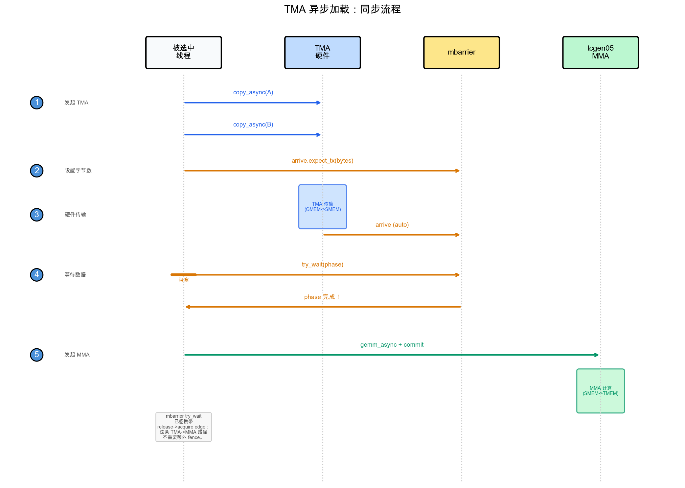

(zh_chap_gemm_async)=
# 用 TMA 对 GEMM 做 Pipelining

:::{admonition} 概览
:class: overview

- basic GEMM 会轮流执行（copy 一个 tile、compute、copy 下一个 tile），而这些事情本可以同时运行，因此浪费时间。
- Step 4 切换到 TMA async load，Step 5 对 SMEM 做 double-buffer 并 prefetch（PIPE_DEPTH=2）；完整 load/compute overlap 会在 Step 7 通过 warp specialization 到来，Step 6 则用 tile scheduler 把 kernel 变成 persistent。
- 目标是在 Tensor Core 咀嚼当前 tile 的同时，load 下一个 tile。
:::

Tensor Core 是芯片上最昂贵的单元，而上一章中正确的 tiled GEMM 会让它们在大部分时钟周期里闲置。
kernel 轮流工作：thread 把一个 tile copy 到 shared memory，Tensor Core 处理它，thread copy 下一个 tile，Tensor Core 等待。
每个 stage 都卡在前一个 stage 上，尽管 load 下一个 tile 和 compute 当前 tile 使用的是完全不同的硬件，本可以同时运行。
缩小这个差距不需要新的数据路径；tile、layout 和数学都已经正确。需要改变的是工作*何时*发生，以及由*谁*调度。
本章保持 tile 数据路径完全不变，直接攻击闲置时间。

我们会通过三个增量步骤到达那里，而且在开始前知道目的地会很有帮助。
Step 4 把 bulk GMEM <-> SMEM transfer 交给 TMA，让专用 copy 硬件移动 tile，而不是 thread。
Step 5 添加 two-stage software pipeline，让下一个 K tile 在当前 tile 仍在相乘时有地方落脚。
Step 6 把 launch 重塑成由 tile scheduler 驱动的 persistent kernel，从而摊销 per-tile setup，
并允许我们选择能让 operand 保持 hot 的 tile 顺序。整个过程中，SMEM、TMEM 和 register layout 都保持上一章留下的样子。
唯一真正的新思想，是硬件单元之间的异步 handoff：让一个引擎跑在另一个前面，而不是 lockstep 前进。

(zh_chap_tma_async)=
## Step 4：TMA Async Load

第一步是把 copy 本身移出 critical path。回想 Step 1-3 中 CTA 在做什么：
它的每个 thread 都在计算地址并发出 load 指令，唯一目的只是把 tile 搬进 SMEM。
这把 instruction bandwidth 花在管线活上，而不是数学上。Step 4 用 TMA 替换同步 `Tx.copy`：
单个 thread 发出一条命令，TMA engine 自己完成整个 tile transfer。
从这里开始，示例运行在完整 M=N=K=4096 尺寸上，而不是 Step 1-3 的小尺寸；
它们的端到端时间会出现在 {ref}`zh_chap_gemm_advanced` 末尾的 *End-to-End Result* 表中。

> **这一步改变什么：Dispatch**
> - Scope：不变，一个 warpgroup。
> - Layout：不变，同样的 SMEM/TMEM/register tile。
> - Dispatch：GMEM → SMEM load 从同步 `Tx.copy` 移到 TMA engine。

### TMA 发射模式

Step 4 的唯一变化，是用 TMA load 替换同步 tile copy，因此值得仔细看这个 load 如何发射。
源码改动只有几行，但这些行背后的执行模型在性质上不同。同步 `Tx.copy` 是 CTA thread 用自己的指令亲自做的工作；
TMA copy 是一个 thread 发出的命令，之后所有移动由 TMA 硬件完成。把二者放在一起看很有价值。

**之前（Step 3）**：全部 128 个 thread 参与 copy，随后 `cta_sync` 让 shared-memory 写入可见：
```python
Tx.cta.copy(Asmem[:, :], A[m_st:m_st+BLK_M, i*BLK_K:(i+1)*BLK_K])   # all 128 threads
Tx.cta.copy(Bsmem[:, :], B[n_st:n_st+BLK_N, i*BLK_K:(i+1)*BLK_K])
T.cuda.cta_sync()
```

**之后（Step 4）**：一个 thread 发射 TMA load，mbarrier 追踪硬件 transfer 何时完成：
```python
tid = warp_id * 32 + lane_id                 # 0..127 within the warpgroup
if tid == 0:  # exactly one thread starts TMA
    Tx.copy_async(Asmem, A[...], dispatch="tma")
    Tx.copy_async(Bsmem, B[...], dispatch="tma")
    T.ptx.mbarrier.arrive.expect_tx(tma_bar, byte_count)  # bytes expected from TMA
T.ptx.mbarrier.try_wait(tma_bar, phase)                  # wait before MMA reads SMEM
```

注意，load 由 `tid == 0` gate，而不是由 `elect_sync()` gate，这个区别比看上去更重要。
`elect.sync` 会*每个 warp* 选出一个 active lane，而一个 warpgroup 有四个 warp，
所以 `elect_sync()` 实际会让四个 thread 进入 load protocol。
问题在于，这个协议会向 mbarrier 宣布 expected byte count，而且必须恰好宣布一次；
四次宣布会破坏 count，wait 将永远无法正确 release。通过 warpgroup-wide id 精确选择一个 thread，是避免这个问题的干净方式。

需要诚实说明 speedup 来自哪里。Step 4 仍然在每次 TMA load 后等待，所以还没有让 load 与 compute overlap；
那是 Step 5 的工作。这里的收益纯粹来自数据移动路径的改变：

- `Tx.copy` 使用 CTA thread 计算地址并发出 load/store 指令。
- TMA 使用一条发出的命令启动硬件 tile transfer。address generation、coalescing 和 swizzling 由 TMA descriptor 描述，并由 TMA engine 执行。

因此，即使 Step 4 仍然在每次 load 上阻塞，它最终仍然更快。TMA 吸收了 bulk transfer，
让 CTA thread 不必花 instruction bandwidth 来搬运 tile；仅这项节省就足以改变性能。

### TMA Load 与 Store 同步

我们已经看到 TMA copy 如何发射；故事的另一半是知道它何时完成。切换到 TMA 会同时改变两件事：
谁启动 copy，以及代码如何知道 copy 已完成。第一点从代码中很明显；第二点容易忽略，搞错后得到的是静默 correctness bug，而不是崩溃。
使用 `Tx.cta.copy` 时，CTA thread 一起做 copy，后面的 `cta_sync()` 足以说明它完成。
使用 TMA 时，一个被选中的 thread 发射 `Tx.copy_async(..., dispatch="tma")`，
engine 按自己的调度执行 transfer，并通过 mbarrier signal completion。

这正是 `cta_sync()` 不再足够的原因。`cta_sync()` 只等待 CTA 自己的 thread，
也只排序它们的 shared-memory 写入；它对 in-flight TMA transfer 一无所知，所以即使 tile 仍在到达，它也会高兴地返回。
修复方式是显式化 completion：对于 TMA load，被选中的 thread 先告诉 mbarrier 应期待多少字节，
然后 CTA 在任何 MMA 触碰 SMEM tile 前等待*那个* mbarrier。下图端到端追踪这个 handshake。



上图隔离了 load 侧 handshake：一个 selected thread launch TMA，mbarrier
统计 expected bytes，MMA 在读取 SMEM 前等待 release。图中写着
“Elected Thread”的地方，意思是启动 TMA 的 selected thread；在我们的代码里是 `tid == 0`
thread，而不是 `elect_sync()` lane。

把 load path 合起来看：selected thread 发出两个 `copy_async` 调用，然后执行 `arrive.expect_tx(total_bytes)`，
其中 byte count 精确表示 mbarrier 应该等待多少数据。当 engine 移动了这么多字节后，
匹配的 `mbarrier.try_wait(phase)` 才会 release；只有这时，SMEM tile 才能安全喂给 MMA。

store 侧经过同样硬件，但等待方式不同，所以需要在脑中清楚区分两种协议：
load 用 mbarrier 和 byte count 追踪 completion，而 store 用 commit group 和 wait group 追踪。
thread 把 fp16 结果写入 `Dsmem` 并同步后，一个 selected thread 启动
`Tx.copy_async(D[...], Dsmem, dispatch="tma")`，随后 `cp_async.bulk.commit_group()`
和 `cp_async.bulk.wait_group(0)` 会阻塞到 store drain。这个 wait 不是可选的：
在前一次 store 离开之前，`Dsmem` 不能被下一个 tile 复用。

**可以让你的 agent 试试**：追踪一个 K tile 上 Step 4 的 load 和 store 同步。
识别哪个 thread 启动每个 TMA command，哪个 mbarrier 或 commit group 追踪 completion，
哪个 wait 保护 MMA 对 `Asmem` 和 `Bsmem` 的读取，哪个 wait 保护 `Dsmem` 的复用。
为什么这里用 `elect_sync()` 选择 TMA load protocol 的 thread 是错误的？

### 完整 Kernel

完整 kernel 把 TMA load 和 store 折进 Step 3 结构中，并保持该结构其余部分不变。import 与之前相同：

```python

import tvm
from tvm.script import tirx as T
from tvm.script.tirx import tile as Tx
from tvm.tirx.layout import TileLayout, S, TLane, TCol, tid_in_wg
from tvm.tirx.cuda.operator.tile_primitive.tma_utils import tma_shared_layout, SwizzleMode
```

它被包在 `hgemm_v4(M, N, K)` 中，这是我们贯穿使用的模式：
wrapper 把 shape-dependent constant 和 layout 放在使用它们的 kernel 旁边。

```python
def hgemm_v4(M, N, K):
    a_type = tvm.DataType("float16")
    b_type = tvm.DataType("float16")
    d_type = tvm.DataType("float16")
    acc_type = tvm.DataType("float32")

    BLK_M, BLK_N, BLK_K = 128, 128, 64
    K_TILES = K // BLK_K
    F16_SIZE = 2

    A_layout = tma_shared_layout(a_type, SwizzleMode.SWIZZLE_128B_ATOM, (BLK_M, BLK_K))
    B_layout = tma_shared_layout(b_type, SwizzleMode.SWIZZLE_128B_ATOM, (BLK_N, BLK_K))
    D_layout = tma_shared_layout(d_type, SwizzleMode.SWIZZLE_128B_ATOM, (BLK_M, BLK_N))

    @T.prim_func
    def kernel(
        A: T.Buffer((M, K), a_type),
        B: T.Buffer((N, K), b_type),
        D: T.Buffer((M, N), d_type),
    ):
        T.device_entry()
        bx, by = T.cta_id([M // BLK_M, N // BLK_N])
        wg_id = T.warpgroup_id([1])
        warp_id = T.warp_id_in_wg([4])
        lane_id = T.lane_id([32])
    
        # --- SMEM allocation (now includes Dsmem for TMA store) ---
        pool = T.SMEMPool()
        tmem_addr = pool.alloc((1,), "uint32")
        tma_bar = pool.alloc((1,), "uint64", align=8)
        mma_bar = pool.alloc((1,), "uint64", align=8)
        pool.move_base_to(1024)
        Asmem = pool.alloc((BLK_M, BLK_K), a_type, layout=A_layout)
        Bsmem = pool.alloc((BLK_N, BLK_K), b_type, layout=B_layout)
        Dsmem = pool.alloc((BLK_M, BLK_N), d_type, layout=D_layout)
        pool.commit()
    
        # --- Barrier + TMEM init ---
        if warp_id == 0 and lane_id == 0:
            T.ptx.mbarrier.init(mma_bar.ptr_to([0]), 1)
            T.ptx.mbarrier.init(tma_bar.ptr_to([0]), 1)
        if warp_id == 0:
            T.ptx.tcgen05.alloc(T.address_of(tmem_addr), n_cols=512, cta_group=1)
    
        T.ptx.fence.proxy_async("shared::cta")
        T.ptx.fence.mbarrier_init()
        T.cuda.cta_sync()
    
        tmem = T.decl_buffer(
            (128, 512), "float32", scope="tmem", allocated_addr=tmem_addr[0],
            layout=TileLayout(S[(128, 512) : (1@TLane, 1@TCol)])
        )
    
        m_st = T.meta_var(bx * BLK_M)
        n_st = T.meta_var(by * BLK_N)
        phase_tma: T.int32 = 0
        phase_mma: T.int32 = 0
    
        # --- Inline helpers ---
        @T.inline
        def tma_load(k_st):
            tma_config = T.meta_var({
                "dispatch": "tma", "cta_group": 1,
                "mbar": tma_bar.ptr_to([0])
            })
            Tx.copy_async(Asmem[:, :],
                          A[m_st : m_st + BLK_M, k_st : k_st + BLK_K],
                          **tma_config)
            Tx.copy_async(Bsmem[:, :],
                          B[n_st : n_st + BLK_N, k_st : k_st + BLK_K],
                          **tma_config)
            T.ptx.mbarrier.arrive.expect_tx(
                tma_bar.ptr_to([0]),
                (BLK_M * BLK_K + BLK_N * BLK_K) * F16_SIZE
            )
    
        @T.inline
        def mma(accum):
            Tx.gemm_async(
                tmem[:, :BLK_N], Asmem[:, :], Bsmem[:, :],
                accum=accum, dispatch="tcgen05", cta_group=1
            )
            T.ptx.tcgen05.commit(mma_bar.ptr_to([0]), cta_group=1)
    
        # --- K-loop with TMA async ---
        tid = T.meta_var(warp_id * 32 + lane_id)
        for k in range(K_TILES):
            k_st = T.meta_var(k * BLK_K)
    
            # Single thread issues TMA load
            if tid == 0:
                tma_load(k_st)
    
            # Wait for TMA to finish; the mbarrier release carries SMEM
            # visibility to the subsequent MMA, so no extra fence is needed.
            T.ptx.mbarrier.try_wait(tma_bar.ptr_to([0]), phase_tma)
    
            # Single thread issues MMA
            if tid == 0:
                mma(accum=k != 0)
    
            # Wait for MMA to finish
            T.ptx.mbarrier.try_wait(mma_bar.ptr_to([0]), phase_mma)
            phase_tma ^= 1
            phase_mma ^= 1
    
        # --- TMA Store Writeback ---
        Dreg = T.alloc_local((BLK_N,), acc_type)
        Dreg_f16 = T.alloc_local((BLK_N,), d_type)
        Dreg_wg = Dreg.view(128, BLK_N,
                            layout=TileLayout(S[(128, BLK_N) : (1@tid_in_wg, 1)]))
    
        # Read TMEM -> registers (async; wait.ld then cta_sync to ensure read completes)
        Tx.wg.copy_async(Dreg_wg[:, :], tmem[:, :BLK_N])
        T.ptx.tcgen05.wait.ld()
        T.cuda.cta_sync()
        # Cast fp32 -> fp16
        Tx.cast(Dreg_f16[:], Dreg[:])
        # Write registers -> Dsmem, flush, then sync
        Tx.copy(Dsmem[warp_id * 32 + lane_id, 0:BLK_N], Dreg_f16[:])
        T.ptx.fence.proxy_async("shared::cta")
        T.cuda.warpgroup_sync(10)
        # TMA store: Dsmem -> GMEM. One selected thread starts the store and drains the
        # store group before Dsmem is reused.
        if tid == 0:
            Tx.copy_async(D[m_st : m_st + BLK_M, n_st : n_st + BLK_N],
                          Dsmem[:, :], dispatch="tma")
            T.ptx.cp_async.bulk.commit_group()
            T.ptx.cp_async.bulk.wait_group(0)
        T.cuda.warpgroup_sync(10)
    
        # --- Deallocate TMEM ---
        T.cuda.cta_sync()
        if warp_id == 0:
            T.ptx.tcgen05.relinquish_alloc_permit(cta_group=1)
            T.ptx.tcgen05.dealloc(tmem_addr[0], n_cols=512, cta_group=1)

    return kernel
```

### Kernel 中的 TMA 配置

这个 kernel 中几乎所有内容都继承自 Step 3。真正承载 TMA 语义的只有五个配置点，值得逐一认识：

- **TMA config**：`{"dispatch": "tma", "cta_group": 1, "mbar": tma_bar.ptr_to([0])}` 告诉 `Tx.copy_async` 使用 TMA，并通过 `tma_bar` 报告 load completion。

- **Byte count**：`(BLK_M * BLK_K + BLK_N * BLK_K) * 2` 是两个 fp16 operand tile 载入的字节数。`arrive.expect_tx(...)` 把这个 count 交给 mbarrier。

- **mbarrier 初始化**：`init(tma_bar.ptr_to([0]), 1)` 创建 TMA load 使用的 completion barrier。

- **`@T.inline`**：`tma_load(...)` 和 `mma(...)` 是 helper function。它们会在编译期展开到 kernel body 中，并且可以使用周围 kernel 的变量。

- **TMA store 同步**：epilogue 先把 fp16 row 写入 `Dsmem`。`fence.proxy_async` 和 `warpgroup_sync`
  让这些由 thread 写入的 SMEM 值对 TMA store 路径 ready。随后 store 使用 `commit_group()` 和 `wait_group(0)`
  等待 SMEM-to-GMEM transfer 完成。

到这里，我们有了正确部件，但节奏仍然错误。Step 4 仍然在启动匹配 MMA 前完成每次 load，
所以 load 和 multiply 从未真正同时运行；我们费力分开的两个引擎仍在轮流工作。
下一步会保持 TMA load 和 store 路径完全不变，只重新安排 schedule，让一个 K tile 的 load 可以在另一个 K tile 上的 compute 运行时进行。

(zh_chap_software_pipeline)=
## Step 5：Software Pipeline（PIPE_DEPTH=2）

既然两个引擎显然是独立的，为什么 Step 4 仍不能让 load 与 compute overlap？
障碍原来是 storage。只有一对 SMEM tile 时，下一个 load 没地方去：
它必须等当前 MMA 读完这一对 tile 后才能开始，因为提前开始会覆写仍在使用的数据。
Step 5 通过 double-buffer shared memory 移除这个 storage conflict。
single-warpgroup loop 仍然会在 launch 下一次 TMA load 前等待每个 MMA，
但现在它有不同 stage 可以 prefetch 和 reuse。我们仍然使用完整 M=N=K=4096 尺寸。

> **这一步改变什么：Layout**
> - Scope：不变，一个 warpgroup。
> - Layout：单个 SMEM tile pair 变成 `PIPE_DEPTH`-stage ring buffer。
> - Dispatch：不变，仍是 TMA load 和 `tcgen05` MMA；这一步加入 prefetch 和 stage reuse，完整 load/compute overlap 会在 Step 7 到来。

### Pipeline Walkthrough

当 `PIPE_DEPTH=2` 时，kernel 会分配两个 SMEM stage，让 load path 和 MMA path 拥有不同 slot 可用。

请把下图读成 two-stage buffer 旨在启用的 pipeline 结构，而不是这个 single-warpgroup kernel 的精确执行 trace。
Step 5 构建 ring buffer，并 prefetch 后续 stage，但主 loop 仍然在发射下一次 TMA load 前等待当前 MMA。
完整 load/compute overlap 会在 Step 7 到来，届时 warp specialization 会给 TMA 和 MMA 分配不同角色。


primed 之后，loop 会在两个 stage 之间交替。两次 TMA load 会预先填满两个 stage；
之后，loop 等待当前 stage，在其上运行 MMA，等待该 MMA 读完这个 stage，
然后把 `k + PIPE_DEPTH` 的 load launch 到刚刚变得可复用的 stage 中。
这还不是 concurrent TMA/MMA schedule，但它建立了 Step 7 将拆分到 producer 和 consumer 角色上的 ring-buffer 结构。

具体来说，代码与 Step 4 有四处不同：

1. `Asmem` 和 `Bsmem` 增加一个 leading `PIPE_DEPTH` 维度，因此每个 stage 有自己的 SMEM storage。
2. `tma_bar` 变成数组，每个 stage 一个 mbarrier。
3. 在主 K loop 之前，kernel prefetch 前两个 stage。
4. K loop 使用 `stage = k % PIPE_DEPTH`：等待当前 stage，在其上运行 MMA，然后为 `k + PIPE_DEPTH` 复用该 stage。

### Pipeline 机制

**1. Prefetch**：在主 loop 运行前，我们 load 前 `PIPE_DEPTH` 个 stage，
让 loop 在第一次 iteration 时就总能发现已有数据在等它：
```python
for s in range(min(PIPE_DEPTH, K_TILES)):
    tma_load(s, s * BLK_K)
```

**2. Main loop**：对每个 K tile，我们等待它的 stage ready，在其上运行 MMA，
然后立即通过 launch 提前 `PIPE_DEPTH` 个 tile 的 load，让这个现在空闲的 stage 重新工作：
```python
stage = k % PIPE_DEPTH
wait(tma_bar[stage], phase_tma)
mma(stage, accum)
wait(mma_bar[0], phase_mma)
phase_mma ^= 1
tma_load(stage, next_k * BLK_K)
```

**3. Phase management**：这是容易绊倒人的部分，但规则比第一眼看上去更简单。
每个 barrier 的 phase-flip 规则直接来自该 barrier 有多少个 slot，这就是两个 barrier 以不同节奏翻转的原因。
MMA accumulator 位于一个 TMEM slot 中，所以 `mma_bar` 是单个 barrier（`mma_bar.ptr_to([0])`），每个 iteration 都会重新访问；
每个 iteration 都重新访问的 barrier，必须每个 iteration 翻转 phase。
TMA barrier 的故事不同：它们形成一个 `PIPE_DEPTH` 元素数组，每个 stage 一个 barrier；
任意给定 stage 的 barrier 只有在 ring 中绕一圈后才会再次出现。因此，`phase_tma` 只在 stage index wrap 回 0 时翻转：
```python
if stage == PIPE_DEPTH - 1:
    phase_tma ^= 1
```

**可以让你的 agent 试试**：在 `PIPE_DEPTH=2` 且 `K_TILES=5` 时，让它追踪主 loop。
对每个 `k`，列出 `stage`、传给 wait 的 `phase_tma` 和 `phase_mma` 值，以及是否发射新的 prefetch。
`phase_tma` 究竟在哪里翻转？为什么最后两个 iteration 没有 prefetch？

### 完整 Kernel

完整 kernel 原样保留 Step 4 的 TMA load 和 store 路径，然后用刚才描述的 staged buffer 和 phase logic 包住它。
import 不变：

```python

import tvm
from tvm.script import tirx as T
from tvm.script.tirx import tile as Tx
from tvm.tirx.layout import TileLayout, S, TLane, TCol, tid_in_wg
from tvm.tirx.cuda.operator.tile_primitive.tma_utils import tma_shared_layout, SwizzleMode
```

它被包在 `hgemm_v5(M, N, K)` 中。`PIPE_DEPTH=2` 常量设置 pipeline stage 数量
（这里是两个，正好是 double buffering）：

```python
PIPE_DEPTH = 2

def hgemm_v5(M, N, K):
    a_type = tvm.DataType("float16")
    b_type = tvm.DataType("float16")
    d_type = tvm.DataType("float16")
    acc_type = tvm.DataType("float32")
    F16_SIZE = 2
    BLK_M, BLK_N, BLK_K = 128, 128, 64
    K_TILES = K // BLK_K

    # Double-buffered layouts: first dimension is pipeline stage
    A_layout = tma_shared_layout(a_type, SwizzleMode.SWIZZLE_128B_ATOM,
                                  (PIPE_DEPTH, BLK_M, BLK_K))
    B_layout = tma_shared_layout(b_type, SwizzleMode.SWIZZLE_128B_ATOM,
                                  (PIPE_DEPTH, BLK_N, BLK_K))
    D_layout = tma_shared_layout(d_type, SwizzleMode.SWIZZLE_128B_ATOM,
                                  (BLK_M, BLK_N))

    @T.prim_func
    def kernel(
        A: T.Buffer((M, K), a_type),
        B: T.Buffer((N, K), b_type),
        D: T.Buffer((M, N), d_type),
    ):
        T.device_entry()
        bx, by = T.cta_id([M // BLK_M, N // BLK_N])
        wg_id = T.warpgroup_id([1])
        warp_id = T.warp_id_in_wg([4])
        lane_id = T.lane_id([32])

        # --- SMEM allocation ---
        pool = T.SMEMPool()
        tmem_addr = pool.alloc((1,), "uint32")
        # Double-buffered TMA barriers (one per stage), single MMA barrier
        tma_bar = pool.alloc((PIPE_DEPTH,), "uint64", align=8)
        mma_bar = pool.alloc((1,), "uint64", align=8)
        pool.move_base_to(1024)
        Asmem = pool.alloc((PIPE_DEPTH, BLK_M, BLK_K), a_type, layout=A_layout)
        Bsmem = pool.alloc((PIPE_DEPTH, BLK_N, BLK_K), b_type, layout=B_layout)
        Dsmem = pool.alloc((BLK_M, BLK_N), d_type, layout=D_layout)
        pool.commit()

        # Initialize barriers: PIPE_DEPTH for TMA, 1 for MMA
        if warp_id == 0:
            if lane_id == 0:
                T.ptx.mbarrier.init(mma_bar.ptr_to([0]), 1)
                for s in range(PIPE_DEPTH):
                    T.ptx.mbarrier.init(tma_bar.ptr_to([s]), 1)
        if warp_id == 0:
            T.ptx.tcgen05.alloc(T.address_of(tmem_addr), n_cols=512, cta_group=1)

        T.ptx.fence.proxy_async("shared::cta")
        T.ptx.fence.mbarrier_init()
        T.cuda.cta_sync()

        tmem = T.decl_buffer(
            (128, 512), acc_type, scope="tmem", allocated_addr=tmem_addr[0],
            layout=TileLayout(S[(128, 512) : (1@TLane, 1@TCol)])
        )

        m_st = T.meta_var(bx * BLK_M)
        n_st = T.meta_var(by * BLK_N)
        phase_tma: T.int32 = 0
        phase_mma: T.int32 = 0

        @T.inline
        def tma_load(stage, k_offset):
            tma_config = T.meta_var({
                "dispatch": "tma", "cta_group": 1,
                "mbar": tma_bar.ptr_to([stage])
            })
            Tx.copy_async(Asmem[stage, :, :],
                          A[m_st:m_st+BLK_M, k_offset:k_offset+BLK_K],
                          **tma_config)
            Tx.copy_async(Bsmem[stage, :, :],
                          B[n_st:n_st+BLK_N, k_offset:k_offset+BLK_K],
                          **tma_config)
            T.ptx.mbarrier.arrive.expect_tx(
                tma_bar.ptr_to([stage]),
                (BLK_M * BLK_K + BLK_N * BLK_K) * F16_SIZE)

        @T.inline
        def mma(stage, accum):
            Tx.gemm_async(tmem[:, :BLK_N], Asmem[stage, :, :], Bsmem[stage, :, :],
                          accum=accum, dispatch="tcgen05", cta_group=1)
            T.ptx.tcgen05.commit(mma_bar.ptr_to([0]), cta_group=1)

        tid = T.meta_var(warp_id * 32 + lane_id)

        # === Prefetch: load first PIPE_DEPTH stages ===
        if tid == 0:
            for s in range(min(PIPE_DEPTH, K_TILES)):
                tma_load(s, s * BLK_K)

        # === Main loop ===
        for k in range(K_TILES):
            stage = k % PIPE_DEPTH

            # Wait for TMA to finish loading this stage
            T.ptx.mbarrier.try_wait(tma_bar.ptr_to([stage]), phase_tma)

            # MMA on this stage's data
            if tid == 0:
                mma(stage, accum=(k != 0))

            T.ptx.mbarrier.try_wait(mma_bar.ptr_to([0]), phase_mma)
            phase_mma ^= 1

            # Issue next prefetch load (k + PIPE_DEPTH)
            next_k = k + PIPE_DEPTH
            if next_k < K_TILES:
                if tid == 0:
                    tma_load(stage, next_k * BLK_K)

            # TMA phase flips when stage wraps around
            if stage == PIPE_DEPTH - 1:
                phase_tma ^= 1

        # === TMA Store Writeback: TMEM -> RF -> Dsmem -> TMA -> GMEM ===
        Dreg = T.alloc_local((BLK_N,), acc_type)
        Dreg_f16 = T.alloc_local((BLK_N,), d_type)
        Dreg_wg = Dreg.view(128, BLK_N,
                            layout=TileLayout(S[(128, BLK_N) : (1@tid_in_wg, 1)]))
        Tx.wg.copy_async(Dreg_wg[:, :], tmem[:, :BLK_N])
        T.ptx.tcgen05.wait.ld()
        T.cuda.cta_sync()
        Tx.cast(Dreg_f16[:], Dreg[:])
        Tx.copy(Dsmem[warp_id * 32 + lane_id, 0:BLK_N], Dreg_f16[:])
        T.ptx.fence.proxy_async("shared::cta")
        T.cuda.warpgroup_sync(10)
        if tid == 0:
            Tx.copy_async(D[m_st : m_st + BLK_M, n_st : n_st + BLK_N],
                          Dsmem[:, :], dispatch="tma")
            T.ptx.cp_async.bulk.commit_group()
            T.ptx.cp_async.bulk.wait_group(0)
        T.cuda.warpgroup_sync(10)

        # Deallocate TMEM
        T.cuda.cta_sync()
        if warp_id == 0:
            T.ptx.tcgen05.relinquish_alloc_permit(cta_group=1)
            T.ptx.tcgen05.dealloc(tmem_addr[0], n_cols=512, cta_group=1)

    return kernel
```

(zh_chap_persistent_kernel)=
## Step 6：Persistent Kernel + Tile Scheduler

到目前为止，一切都在优化单个 tile 内部的工作。Step 6 改变问题的尺度，开始跨 tile 优化。

Step 5 为每个 128 x 128 output tile 启动一个 CTA。对于 4096 x 4096 输出，
这意味着 1024 个独立 CTA，每个 CTA 都支付自己的 setup cost，并在自己的 tile 完成后立即消失。

Step 6 改为启动固定 CTA 池，然后让每个 CTA 依次处理多个 tile。
这带来两点收益：setup work 被摊销到多个 tile 上；tile assignment 移入 kernel 内部，
在那里 scheduler 可以选择一种能复用 operand 的顺序。我们仍保持完整 M=N=K=4096 尺寸。

> **这一步改变什么：Scope**
> - Scope：固定的 persistent CTA 池，每个 CTA 通过 scheduler 循环处理多个 output tile。
> - Layout：不变，同样的 per-tile SMEM/TMEM/register 路径。
> - Dispatch：不变。

### Persistent Scheduling

persistent kernel 的定义性想法是：按硬件规模，而不是按问题规模来设置 grid。
它启动 `SM_COUNT` 个 CTA，大致每个 SM 一个，不管实际有多少 output tile，目标是让每个 SM 持续保持占用。
我们有意说“大致”：精确 1:1 residency 并不保证，因为它取决于 occupancy，也取决于硬件如何调度 CTA。

在这里目标的 B200 上，`SM_COUNT=148`。这 148 个 CTA 中的每一个，都会循环处理
`ClusterPersistentScheduler2D` 分配给它的 tile。

第一项收益是摊销。TMEM allocation、barrier initialization 和 scheduler state 现在每个 CTA 只发生一次，
并在该 CTA 处理的大约 7 个 tile 间复用，而不是在一次性 CTA 上重复 1024 次。

第二项收益来自 scheduler 选择的顺序。设置 `l2_group_size=8` 会把相邻 tile 分组，
因此共享同一 row band 的 tile 会复用相同 A row-tile，共享同一 column band 的 tile 会复用相同 B tile。
背靠背运行这些 tile，可以让 operand 在 L2 中保持 hot，而不是从 HBM 重新获取。
这正是 Step 3 留在桌面上的复用。

```python
bx = T.cta_id([SM_COUNT])  # 1D grid, one CTA per SM

tile_scheduler = ClusterPersistentScheduler2D(
    "ts",
    num_m_tiles=M // BLK_M,
    num_n_tiles=N // BLK_N,
    l2_group_size=8,       # Group 8 nearby tiles together
    num_clusters=SM_COUNT
)
tile_scheduler.init(bx)
```

跨 tile 循环带来一个容易漏掉的 correctness 后果。每个 tile 都运行自己的全新 K-loop，
这意味着它的 barrier phase 必须从已知状态开始。Step 5 中，一个 CTA 恰好处理一个 tile，
所以只初始化一次 `phase_tma` 和 `phase_mma` 完全没问题。
Step 6 中，这些 initializer 必须移到 `while tile_scheduler.valid()` loop *内部*，
让每个 tile 都以匹配自己 TMA 和 MMA 工作的 phase state 开始，而不是继承前一个 tile 偶然留下的状态：

```python
while tile_scheduler.valid():
    phase_tma: T.int32 = 0
    phase_mma: T.int32 = 0
    ...
```

### 完整 Kernel

从结构上说，这个 kernel 只是把 Step 5 的 pipeline 包在 tile-level outer loop 里。
唯一新的依赖是 scheduler 本身，我们把它和其他依赖一起 import：

```python

import tvm
from tvm.script import tirx as T
from tvm.script.tirx import tile as Tx
from tvm.tirx.layout import TileLayout, S, TLane, TCol, tid_in_wg
from tvm.tirx.cuda.operator.tile_primitive.tma_utils import tma_shared_layout, SwizzleMode
from tvm.tirx.lang.tile_scheduler import ClusterPersistentScheduler2D
```

grid dimension 现在只是 `SM_COUNT`，而不是 `(M//BLK_M, N//BLK_N)`；
`ClusterPersistentScheduler2D` 接管了给每个 CTA 分配 tile 的工作：

```python
SM_COUNT = 148  # Number of SMs on NVIDIA B200 GPU
PIPE_DEPTH = 2

def hgemm_v6(M, N, K):
    a_type = tvm.DataType("float16")
    b_type = tvm.DataType("float16")
    d_type = tvm.DataType("float16")
    acc_type = tvm.DataType("float32")
    F16_SIZE = 2
    BLK_M, BLK_N, BLK_K = 128, 128, 64
    K_TILES = K // BLK_K

    A_layout = tma_shared_layout(a_type, SwizzleMode.SWIZZLE_128B_ATOM,
                                  (PIPE_DEPTH, BLK_M, BLK_K))
    B_layout = tma_shared_layout(b_type, SwizzleMode.SWIZZLE_128B_ATOM,
                                  (PIPE_DEPTH, BLK_N, BLK_K))
    D_layout = tma_shared_layout(d_type, SwizzleMode.SWIZZLE_128B_ATOM,
                                  (BLK_M, BLK_N))

    @T.prim_func
    def kernel(
        A: T.Buffer((M, K), a_type),
        B: T.Buffer((N, K), b_type),
        D: T.Buffer((M, N), d_type),
    ):
        T.device_entry()
        # 1D grid: one CTA per SM (not a 2D grid anymore!)
        bx = T.cta_id([SM_COUNT])
        wg_id = T.warpgroup_id([1])
        warp_id = T.warp_id_in_wg([4])
        lane_id = T.lane_id([32])

        # --- SMEM allocation (same as Step 5) ---
        pool = T.SMEMPool()
        tmem_addr = pool.alloc((1,), "uint32")
        tma_bar = pool.alloc((PIPE_DEPTH,), "uint64", align=8)
        mma_bar = pool.alloc((1,), "uint64", align=8)
        pool.move_base_to(1024)
        Asmem = pool.alloc((PIPE_DEPTH, BLK_M, BLK_K), a_type, layout=A_layout)
        Bsmem = pool.alloc((PIPE_DEPTH, BLK_N, BLK_K), b_type, layout=B_layout)
        Dsmem = pool.alloc((BLK_M, BLK_N), d_type, layout=D_layout)
        pool.commit()

        # --- Barrier + TMEM init (same as Step 5) ---
        if warp_id == 0 and lane_id == 0:
            T.ptx.mbarrier.init(mma_bar.ptr_to([0]), 1)
            for s in range(PIPE_DEPTH):
                T.ptx.mbarrier.init(tma_bar.ptr_to([s]), 1)
        if warp_id == 0:
            T.ptx.tcgen05.alloc(T.address_of(tmem_addr), n_cols=512, cta_group=1)
        T.ptx.fence.proxy_async("shared::cta")
        T.ptx.fence.mbarrier_init()
        T.cuda.cta_sync()

        tmem = T.decl_buffer(
            (128, 512), acc_type, scope="tmem", allocated_addr=tmem_addr[0],
            layout=TileLayout(S[(128, 512) : (1@TLane, 1@TCol)])
        )

        # Tile scheduler: assigns tiles to CTAs in L2-friendly order
        tile_scheduler = ClusterPersistentScheduler2D(
            "ts",
            num_m_tiles=M // BLK_M,
            num_n_tiles=N // BLK_N,
            l2_group_size=8,
            num_clusters=SM_COUNT
        )
        tile_scheduler.init(bx)

        tid = T.meta_var(warp_id * 32 + lane_id)

        @T.inline
        def tma_load(stage, k_offset, m_st, n_st):
            tma_config = T.meta_var({
                "dispatch": "tma", "cta_group": 1,
                "mbar": tma_bar.ptr_to([stage])
            })
            Tx.copy_async(Asmem[stage, :, :],
                          A[m_st:m_st+BLK_M, k_offset:k_offset+BLK_K],
                          **tma_config)
            Tx.copy_async(Bsmem[stage, :, :],
                          B[n_st:n_st+BLK_N, k_offset:k_offset+BLK_K],
                          **tma_config)
            T.ptx.mbarrier.arrive.expect_tx(
                tma_bar.ptr_to([stage]),
                (BLK_M * BLK_K + BLK_N * BLK_K) * F16_SIZE)

        @T.inline
        def mma(stage, accum):
            Tx.gemm_async(tmem[:, :BLK_N], Asmem[stage, :, :], Bsmem[stage, :, :],
                          accum=accum, dispatch="tcgen05", cta_group=1)
            T.ptx.tcgen05.commit(mma_bar.ptr_to([0]), cta_group=1)

        # === Outer loop: iterate over tiles ===
        while tile_scheduler.valid():
            # Get current tile position from scheduler
            m_st = T.meta_var(tile_scheduler.m_idx * BLK_M)
            n_st = T.meta_var(tile_scheduler.n_idx * BLK_N)

            # === Inner loop: same pipeline as Step 5 ===
            phase_tma: T.int32 = 0
            phase_mma: T.int32 = 0

            # Prefetch first PIPE_DEPTH stages
            if tid == 0:
                for s in range(min(PIPE_DEPTH, K_TILES)):
                    tma_load(s, s * BLK_K, m_st, n_st)

            # Main K-loop
            for k in range(K_TILES):
                stage = k % PIPE_DEPTH
                T.ptx.mbarrier.try_wait(tma_bar.ptr_to([stage]), phase_tma)
                if tid == 0:
                    mma(stage, accum=(k != 0))
                T.ptx.mbarrier.try_wait(mma_bar.ptr_to([0]), phase_mma)
                phase_mma ^= 1
                next_k = k + PIPE_DEPTH
                if next_k < K_TILES:
                    if tid == 0:
                        tma_load(stage, next_k * BLK_K, m_st, n_st)
                if stage == PIPE_DEPTH - 1:
                    phase_tma ^= 1

            # === TMA Store Writeback: TMEM -> RF -> Dsmem -> TMA -> GMEM ===
            Dreg = T.alloc_local((BLK_N,), acc_type)
            Dreg_f16 = T.alloc_local((BLK_N,), d_type)
            Dreg_wg = Dreg.view(128, BLK_N,
                                layout=TileLayout(S[(128, BLK_N) : (1@tid_in_wg, 1)]))
            Tx.wg.copy_async(Dreg_wg[:, :], tmem[:, :BLK_N])
            T.ptx.tcgen05.wait.ld()
            T.cuda.cta_sync()
            Tx.cast(Dreg_f16[:], Dreg[:])
            Tx.copy(Dsmem[warp_id * 32 + lane_id, 0:BLK_N], Dreg_f16[:])
            T.ptx.fence.proxy_async("shared::cta")
            T.cuda.warpgroup_sync(10)
            if tid == 0:
                Tx.copy_async(D[m_st : m_st + BLK_M, n_st : n_st + BLK_N],
                              Dsmem[:, :], dispatch="tma")
                T.ptx.cp_async.bulk.commit_group()
                T.ptx.cp_async.bulk.wait_group(0)
            T.cuda.warpgroup_sync(10)

            T.cuda.cta_sync()
            tile_scheduler.next_tile()  # Move to next tile

        # Deallocate TMEM
        T.cuda.cta_sync()
        if warp_id == 0:
            T.ptx.tcgen05.relinquish_alloc_permit(cta_group=1)
            T.ptx.tcgen05.dealloc(tmem_addr[0], n_cols=512, cta_group=1)

    return kernel
```

## 练习

1. 在 Step 4 中，`arrive.expect_tx` 使用 `(BLK_M * BLK_K + BLK_N * BLK_K) * 2` 字节。如果这个 byte count 太小或太大，mbarrier 会等待什么？
2. 在 Step 5 中，为什么每个 SMEM stage 都需要自己的 TMA barrier，而不是两个 stage 共享一个 `tma_bar`？
3. 在 Step 6 中，`BLK_M=BLK_N=128` 时，一个 4096 x 4096 输出有多少个 output tile？当 `SM_COUNT=148` 时，每个 persistent CTA 平均处理多少个 tile？
