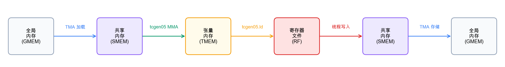

(zh_chap_gemm_basics)=
# 构建 Tiled GEMM

:::{admonition} 概览
:class: overview

- 从单个 output tile 开始，用 TIRx tile primitives 构建一个正确的 tiled GEMM。
- Step 1 是 single-tile GEMM，Step 2 添加 K-loop accumulation，Step 3 针对完整矩阵跨 CTA 做 spatial tiling。
- 正确性优先；性能是后两章的任务。
:::

GEMM 是整本书围绕的工作负载。它位于 linear layer、attention projection 和 convolution 之下，
而这些操作主导着 GPU 时间。因此，正确 GEMM 和快速 GEMM 之间的差距，
就是让芯片大部分闲置和把芯片打满之间的差距。

这个差距太大，无法一步跨过。一个能打满硬件的 kernel 会让你同时 debug memory movement、accumulation、tiling 和 Tensor Core scheduling，
而且没有可信对象可供比较。更安全的路径是从能产生正确答案的最小 kernel 开始，然后一次增加一个决策。

本章会写出第一个正确的 tiled GEMM。前面章节从抽象层面介绍了 TIRx 的 scope / layout / dispatch 模型；
这里我们把它应用到真实 kernel。我们从一个 128 x 128 output tile 开始，
逐步把它扩展成能处理完整矩阵的 kernel：先加入 K 维度 accumulation，再跨多个 CTA 加入 spatial tiling。

这是三章 GEMM 优化路径中的第一章，三章会端到端走完同一条路径。本章构建一个正确的 tiled kernel，并到此为止。
下一章（{ref}`zh_chap_gemm_async`）会用 TMA 替换 thread copy，并通过 pipelining 让数据移动和计算 overlap；
{ref}`zh_chap_gemm_advanced` 则进一步加入 warp specialization 和 CTA cluster。
每章都建立在前一章之上，所以 kernel 会逐步积累功能，而不是从头再来。

把每一步读成对同一个三项 contract 的修改会很有帮助：哪个 **scope** 运行操作，operand tile 使用哪个 **layout**，
以及由哪条 **dispatch** 路径执行。大多数步骤都有一个主要变化，所以我们会用一个小卡片开头，点明这个变化，
并指出为了安全复用而需要的同步细节。Step 1 建立后续路径要不断修改的 baseline。

## GEMM

GEMM 是 dense matrix multiply，位于 linear layer、attention projection 和许多 convolution 实现之下；
因此，快速 GEMM kernel 几乎处处都有回报。本教程中的例子使用 $D = A B^{\top}$：

- $A$ 的 shape 是 $M \times K$。
- $B$ 的 shape 是 $N \times K$。
- $D$ 的 shape 是 $M \times N$。
- $D[m,n] = \sum_k A[m,k] \cdot B[n,k]$.

transpose 不是我们选择额外执行的操作；它来自数据的存储方式。
这些例子把 $B$ 保持为 $N$ 行、每行长度 $K$，这通常也是 linear-layer weight 的 layout。
因此，沿 $K$ contract 会自然读取 $B^{\top}$，不需要任何重排。

整个教程中，我们用 TFLOPS 吞吐来衡量 kernel：把每次 multiply-add 计为两个 floating-point operation，
再除以 wall-clock time：

$$\text{TFLOPS} = \frac{2 \times M \times N \times K}{t_{\text{seconds}} \times 10^{12}}$$

### GEMM 数据路径

本教程中的每个优化最终都落到数据住在哪里、如何移动，所以在写代码前值得先把这条路径画出来。
从核心上说，Blackwell GEMM kernel 围绕两类活动组织：在不同内存之间移动 tile，以及在 tile 上计算。
下图追踪一个 tile 从输入到输出过程中接触的每个内存空间：



上图展示了 baseline 路径：后续每个优化都会修改它，但不会替换它。
从左到右读：operand tile 先从 GMEM 移到 SMEM；随后 `tcgen05.mma` 消费 SMEM operand，
并把 accumulator 写入 TMEM；最后 epilogue 先把 TMEM 读回寄存器，再把结果存到 GMEM。
请记住这条链路，因为下面每一步只会改变某一跳*如何*发生，而不会改变这些跳本身。

## 优化路径

上面这条朴素数据路径足以得到正确答案，但会让大部分硬件闲置。
教程剩余部分会一次加入一个 Blackwell 特性来缩小这个差距，而每个特性都通过 TIRx tile primitive 表达。
我们将依次经过这些特性：

- **TMA async movement** 通过 Blackwell 的硬件 copy path 移动 GMEM <-> SMEM tile，并用 barrier 追踪 completion。
- **Software pipelining** 使用多个 SMEM stage，让下一个 K tile 的数据移动可以与当前 tile 上的 Tensor Core 计算 overlap。
- **Persistent scheduling** 保持固定 CTA 池，每个 CTA 通过 tile scheduler 处理许多 output tile，而不是每个 tile 启动一个 CTA。
- **Warp specialization** 把 producer、MMA consumer 和 writeback 角色拆到独立 warpgroup 上。
- **CTA clusters** 让两个 CTA 协作处理一个更大的 Blackwell MMA tile。
- **Multi-consumer execution** 使用多个 consumer warpgroup 同时计算 tile 的不同部分，提高 compute density。

---

(zh_chap_single_tile)=
## Step 1：顺序 Single-Tile GEMM

仍然能走完整硬件路径的最简单 GEMM，是计算单个 output tile 的 GEMM。所以我们从这里开始。
Step 1 计算一个 128 x 128 output tile，K = 64；它足够小，不需要任何 loop，
而数据路径的每个部分都恰好出现一次。由于没有重复，我们可以在需要推理 loop 之前，先孤立地观察每一跳。

> **这一步建立什么：baseline**
> - Scope：一个包含 128 个 thread 的单个 warpgroup 按顺序走完整条路径，一个 stage 接一个 stage。
> - Layout：A 和 B tile 位于 SMEM，accumulator 位于 TMEM，结果通过寄存器 stage 出去。
> - Dispatch：同步 `Tx.copy` 执行 load，`tcgen05` 执行 MMA。

### Single-Tile Dataflow

baseline contract 固定后，接下来要确定的是一个 tile 穿过它的顺序。
第一个 kernel 会精确走一次核心 GEMM 数据路径，也就是数据流图中的同一条 GMEM -> SMEM -> TMEM -> registers -> GMEM 链，
外面没有任何 loop。它分配工作内存、载入 operand、计算乘积、写回结果，并清理自身：

1. **分配**：SMEM（pool allocator）、TMEM（`tcgen05.alloc`）、mbarrier
2. **加载**：全部 128 个 thread 协作地把 A 和 B tile 从 GMEM copy 到 SMEM（同步 `Tx.copy`）
3. **计算**：单个 elected thread 发射 `Tx.gemm_async` + `tcgen05.commit`；所有 thread 等待 mbarrier
4. **写回**：warpgroup 读取 TMEM → registers；每个 thread 把 fp32 cast 为 fp16 并写到 GMEM
5. **释放**：释放 TMEM

### 第一个 Kernel 的四个部分

完整 kernel 只有几十行，但分块阅读更容易消化。我们会分四部分阅读它：
memory allocation、synchronous load、MMA dispatch 和 writeback，之后再把它们组装成一个 kernel。
过程中出现的 API 名称，是第二部分介绍的 TIRx tile-primitive 词汇（{ref}`zh_chap_tirx_primer`，{ref}`zh_chap_tirx_layout_api`）。

**Memory allocation。** kernel 首先为 operand 切出 shared memory，同时为 TMEM address 和 mbarrier 留出 slot：

```python
pool = T.SMEMPool()
tmem_addr = pool.alloc((1,), "uint32")           # TMEM address (4 bytes)
mma_bar = pool.alloc((1,), "uint64", align=8)    # mbarrier (8 bytes)
pool.move_base_to(1024)                           # Skip to offset 1024
Asmem = pool.alloc((BLK_M, BLK_K), a_type, layout=A_layout)  # 128×64 fp16
Bsmem = pool.alloc((BLK_N, BLK_K), b_type, layout=B_layout)  # 128×64 fp16
pool.commit()
```

这里有两个细节值得停一下。`pool.move_base_to(1024)` 把 Asmem 和 Bsmem 推到 offset 1024，
把低地址留给前面那些小 metadata，让体积较大的 operand tile 落在干净边界上。
另外，`layout=A_layout` 会向 `tma_shared_layout` 请求一个 swizzled SMEM placement，
它能被 TMA 和 `tcgen05.mma` 直接读取，正是第二部分描述的那种 layout-as-contract 义务。

**Synchronous load。** buffer 到位后，operand 仍然必须到达 SMEM。在第一个版本中，我们让 CTA 自己的 thread 完成 copy：

```python
Tx.cta.copy(Asmem[:, :], A[:, :])
Tx.cta.copy(Bsmem[:, :], B[:, :])
T.cuda.cta_sync()
```

因为这里只存在一个 tile（M=N=128，K=64），copy 整个 A 和 B 就是全部 load。
`Tx.cta.copy(...)` 让 CTA 协作完成这次 copy，每个 thread 负责自己的数据切片。
后面的 `T.cuda.cta_sync()` 一举两得：它等待每个 thread 完成，同时发布它们的 shared-memory 写入；
这样后续 MMA 读取 `Asmem` 和 `Bsmem` 时，看到的是完整 tile，而不是半填充 buffer。
这种 thread-driven copy 也是我们首先要替换的东西；下一章（{ref}`zh_chap_gemm_async`）会把它换成 TMA。

**MMA dispatch。** operand 现在位于 SMEM 中，我们可以发射 MMA，并且从单个 elected thread 发射：

```python
if warp_id == 0:
    if T.ptx.elect_sync():
        Tx.gemm_async(tmem[:, :BLK_N], Asmem[:, :], Bsmem[:, :],
                      accum=False, dispatch="tcgen05", cta_group=1)
        T.ptx.tcgen05.commit(mma_bar.ptr_to([0]), cta_group=1)
```

两个嵌套 guard 分两步缩小 issuer。外层 `if warp_id == 0` 只保留 warpgroup 中的 warp 0；
内层 `if T.ptx.elect_sync():` 随后在该 warp 中选出一个 active lane。
二者合起来只留下一个 thread 来运行 `Tx.gemm_async` 和 `tcgen05.commit`。

这里值得说清楚这个单个 thread 意味着什么、不意味着什么，因为自然读法很容易误导。
单个 issuing thread *并不*意味着单线程乘法。计算仍然是完整 tile-level MMA：
硬件会为 SMEM operand layout 和 TMEM accumulator layout 所描述的 tile 执行 cooperative multiply。
关键在于 `Tx.gemm_async` 是一个 *tile operation*，不是一条硬件指令。
K = 64 的 tile 比硬件 MMA K-atom（`MMA_K = 16`）更宽，因此这个 tile op 会 lower 成沿 K 方向前进的一小段 raw `tcgen05.mma` 指令，
warpgroup 会协作驱动其中每一条。只有一个 thread 发射 tile op 的原因是，每个底层 `tcgen05.mma`
本身就是一个 *single-instruction* cooperative op：一次 launch 驱动 tile MMA 的那个 K-atom。
如果全部 128 个 thread 都发射这个序列，相同工作只会被重复 launch 128 次。
最后，`accum=False` flag 告诉 MMA 覆写 TMEM destination，而不是加到其中；
这正是我们这里想要的，因为没有先前 partial sum 需要扩展。

**Writeback。** 乘积现在位于 TMEM 中，但 caller 想要它以 fp16 回到 GMEM。
因此 epilogue 必须通过寄存器把结果带下来，并在途中 cast：

```python
Dreg = T.alloc_local((BLK_N,), acc_type)        # per-thread fp32 register row
Dreg_f16 = T.alloc_local((BLK_N,), d_type)      # same row, cast to fp16
Dreg_wg = Dreg.view(128, BLK_N, layout=TileLayout(S[(128, BLK_N) : (1@tid_in_wg, 1)]))
Tx.wg.copy_async(Dreg_wg[:, :], tmem[:, :BLK_N])
T.ptx.tcgen05.wait.ld()
Tx.cast(Dreg_f16[:], Dreg[:])
m_thr = T.meta_var(m_st + warp_id * 32 + lane_id)
Tx.copy(D[m_thr, n_st : n_st + BLK_N], Dreg_f16[:])
```

MMA 会在 TMEM 中留下一个 128 x 128 fp32 accumulator tile。fp32 是有意选择的：
GEMM 会沿 K 累加许多乘积，用更高精度保存 running sum 可以压低本来会积累的舍入误差。
但 `D` 是 fp16，所以这些值不能直接写出。它们先落入寄存器，在那里缩窄为 fp16，然后才到达 GMEM。

两个 register buffer 扮演不同角色。`Dreg` 是每个 thread 的 `BLK_N` 元素 buffer，
而 `Dreg_wg` 是同一批寄存器在选定 layout 下的 warpgroup-wide *view*：

```python
TileLayout(S[(128, BLK_N) : (1@tid_in_wg, 1)])
```

这个 layout 把 tile 的第一维映射到 warpgroup 的 thread：thread 0 拥有 row 0，thread 1 拥有 row 1，
依此类推直到 row 127。第二维保留在每个 thread 自己的 register buffer 中，
所以一个 thread 持有自己那一行的所有 column。warpgroup 中有 128 个 thread，tile 中有 128 行，
因此 128 x 128 输出正好分成每个 thread 一行。

在这个 view 下读出 accumulator，正是 `Tx.wg.copy_async(Dreg_wg, tmem)` 所做的事；
它会 lower 到 Blackwell TMEM load path，即 `tcgen05.ld`。因为这个 load 是异步的，
`T.ptx.tcgen05.wait.ld()` 必须在任何 thread 触碰 `Dreg` 前完成；否则 thread 可能读取 load 还没有填好的寄存器。

wait 返回后，每个 thread 私有的 `Dreg[:]` 都持有自己那一条逻辑 output row 的 fp32 值。
thread 在 `Dreg_f16` 中把这些值缩窄为 fp16，并算出自己负责哪个 global row：

```python
m_thr = T.meta_var(m_st + warp_id * 32 + lane_id)
```

然后写入 `D[m_thr, n_st:n_st + BLK_N]`。这些 row 干净地分布在四个 warp 上：
warp 0 写 row 0-31，warp 1 写 row 32-63，warp 2 写 row 64-95，warp 3 写 row 96-127。

### 完整 Kernel

现在把四个部分重新拼成一个可运行 kernel（M=N=128，K=64）。先是 import：

```python

import tvm
from tvm.script import tirx as T
from tvm.script.tirx import tile as Tx
from tvm.tirx.cuda.operator.tile_primitive.tma_utils import tma_shared_layout, SwizzleMode
from tvm.tirx.layout import TileLayout, S, TLane, TCol, tid_in_wg
```

kernel 包在后续步骤也会使用的 `hgemm_vX(M, N, K)` 风格中。
Step 1 使用 `M=N=128, K=64` 运行，因此 launch 恰好包含一个 output tile：

```python
def hgemm_v1(M, N, K):
    a_type = tvm.DataType("float16")
    b_type = tvm.DataType("float16")
    d_type = tvm.DataType("float16")
    acc_type = tvm.DataType("float32")

    BLK_M, BLK_N, BLK_K = 128, 128, 64
    # MMA_M/MMA_N/MMA_K document the underlying hardware MMA tile; they are not
    # passed to gemm_async (which derives the MMA shape from the operand and
    # accumulator tiles), so the later steps omit them.
    MMA_M, MMA_N, MMA_K = 128, 128, 16

    A_layout = tma_shared_layout(a_type, SwizzleMode.SWIZZLE_128B_ATOM, (BLK_M, BLK_K))
    B_layout = tma_shared_layout(b_type, SwizzleMode.SWIZZLE_128B_ATOM, (BLK_N, BLK_K))

    @T.prim_func
    def kernel(
        A: T.Buffer((M, K), a_type),
        B: T.Buffer((N, K), b_type),
        D: T.Buffer((M, N), d_type),
    ):
        T.device_entry()
        # Step 1 is a single-tile kernel: M = BLK_M and N = BLK_N, so the grid
        # is 1x1. Starting with a 1x1 grid keeps the per-CTA tile offsets
        # (m_st, n_st) trivially zero; Steps 3+ generalise this to larger M / N.
        bx, by = T.cta_id([M // BLK_M, N // BLK_N])
        wg_id = T.warpgroup_id([1])      # single warpgroup, so wg_id is always 0 (unused below)
        warp_id = T.warp_id_in_wg([4])
        lane_id = T.lane_id([32])
    
        # --- SMEM allocation ---
        pool = T.SMEMPool()
        tmem_addr = pool.alloc((1,), "uint32")
        mma_bar = pool.alloc((1,), "uint64", align=8)
        pool.move_base_to(1024)
        Asmem = pool.alloc((BLK_M, BLK_K), a_type, layout=A_layout)
        Bsmem = pool.alloc((BLK_N, BLK_K), b_type, layout=B_layout)
        pool.commit()
    
        # --- Barrier + TMEM init (warp 0 only) ---
        if warp_id == 0:
            if lane_id == 0:
                T.ptx.mbarrier.init(mma_bar.ptr_to([0]), 1)
            T.ptx.tcgen05.alloc(T.address_of(tmem_addr), n_cols=512, cta_group=1)
    
        T.ptx.fence.proxy_async("shared::cta")
        T.ptx.fence.mbarrier_init()
        T.cuda.cta_sync()
    
        tmem = T.decl_buffer(
            (128, 512), "float32", scope="tmem", allocated_addr=tmem_addr[0],
            layout=TileLayout(S[(128, 512) : (1@TLane, 1@TCol)])
        )
    
        m_st = T.meta_var(bx * BLK_M)
        n_st = T.meta_var(by * BLK_N)
        phase_mma: T.int32 = 0
    
        # --- Load: all threads copy global -> shared (synchronous).
        # With M=BLK_M and N=BLK_N the slices below cover the full matrices;
        # the slice form is kept so the diff to Step 3 (multi-tile) is minimal.
        Tx.cta.copy(Asmem[:, :], A[m_st:m_st + BLK_M, :])
        Tx.cta.copy(Bsmem[:, :], B[n_st:n_st + BLK_N, :])
        T.cuda.cta_sync()
    
        # --- Compute: single elected thread issues MMA ---
        if warp_id == 0:
            if T.ptx.elect_sync():
                Tx.gemm_async(
                    tmem[:, :BLK_N], Asmem[:, :], Bsmem[:, :],
                    accum=False, dispatch="tcgen05", cta_group=1
                )
                T.ptx.tcgen05.commit(mma_bar.ptr_to([0]), cta_group=1)
    
        T.ptx.mbarrier.try_wait(mma_bar.ptr_to([0]), phase_mma)
    
        # --- Writeback: TMEM -> RF -> GMEM ---
        Dreg = T.alloc_local((BLK_N,), acc_type)
        Dreg_f16 = T.alloc_local((BLK_N,), d_type)
        Dreg_wg = Dreg.view(128, BLK_N,
                            layout=TileLayout(S[(128, BLK_N) : (1@tid_in_wg, 1)]))
        Tx.wg.copy_async(Dreg_wg[:, :], tmem[:, :BLK_N])
        T.ptx.tcgen05.wait.ld()
        Tx.cast(Dreg_f16[:], Dreg[:])
        m_thr = T.meta_var(m_st + warp_id * 32 + lane_id)
        Tx.copy(D[m_thr, n_st : n_st + BLK_N], Dreg_f16[:])
    
        # --- Deallocate TMEM ---
        T.cuda.cta_sync()
        if warp_id == 0:
            T.ptx.tcgen05.relinquish_alloc_permit(cta_group=1)
            T.ptx.tcgen05.dealloc(tmem_addr[0], n_cols=512, cta_group=1)

    return kernel
```

后续每个 GEMM step 都会用同样方式编译、运行和检查自己，所以我们只在这里把这套 scaffolding 完整写一次，
之后只展示 kernel。要运行后续 step，把下面的 `hgemm_vX` 和对应 problem size 换掉即可。
有一点需要记住：每个全新的 Python session 只编译一个 step，尝试另一个 step 前请重启，
因为这些例子会复用内部名称，而编译器持有 per-session state。

```python
import torch

target = tvm.target.Target("cuda")
device = torch.device('cuda')  # gpu(0)

M, N, K = 128, 128, 64
kernel = hgemm_v1(M, N, K)
with target:
    ex = tvm.compile(tvm.IRModule({"main": kernel}), target=target, tir_pipeline="tirx")

torch.cuda.empty_cache()
torch.cuda.synchronize()
A_tensor = torch.randn(M, K, dtype=torch.float16, device=device)
B_tensor = torch.randn(N, K, dtype=torch.float16, device=device)
D_tensor = torch.zeros(M, N, dtype=torch.float16, device=device)

# ex.mod(...) takes torch tensors directly, the same call form used in every chapter.
ex.mod(A_tensor, B_tensor, D_tensor)

D_ref = (A_tensor.float() @ B_tensor.float().T).half()
max_err = float((D_tensor - D_ref).abs().max())
print(f"Max error vs torch reference: {max_err:.6f}")
# Relative tolerance, like the warp-specialization and Flash Attention cells:
# output magnitude grows with K, so a fixed absolute bound would fail at larger K.
torch.testing.assert_close(D_tensor, D_ref, rtol=2e-2, atol=1e-2)
print("PASS")

# Optional timing for larger kernels.
ITERS = 10
for _ in range(3):
    ex.mod(A_tensor, B_tensor, D_tensor)
torch.cuda.synchronize()
start = torch.cuda.Event(enable_timing=True)
end = torch.cuda.Event(enable_timing=True)
start.record()
for _ in range(ITERS):
    ex.mod(A_tensor, B_tensor, D_tensor)
end.record()
torch.cuda.synchronize()
ms = start.elapsed_time(end) / ITERS
tflops = 2 * M * N * K / ms / 1e9
print(f"Performance: {ms:.3f} ms, {tflops:.1f} TFLOPS")
```

Step 1 到 Step 3 会刻意用较小尺寸运行（这里是 128×128，Step 3 是 256³），让最初的 walkthrough 容易跟随。
{ref}`zh_chap_gemm_advanced` 末尾的跨 step *End-to-End Result* 表格采取相反做法：
它在统一的 M=N=K=4096 尺寸下测量每个 step，包括这个 Step 1 算法，从而让 speedup ratio 可以直接比较。

### Single-Tile Kernel 的限制

这个 kernel 是正确的，而这正是 Step 1 的全部目的；但它只在非常狭窄的设置中正确。
我们有意内置了四个限制，优化路径剩余部分会一次解除一个：

- 它只处理单个 K tile，因此无法在大 K 上 contract。
- 它只处理单个 output tile，因此 M 和 N 被固定为 128。
- 它使用同步 GMEM -> SMEM copy，而不是 TMA。
- 它不会让数据移动和计算 overlap，因此二者从不同时运行。

---

(zh_chap_k_loop)=
## Step 2：K-Loop Accumulation

要移除的第一个限制是最小的那个。Step 1 只处理单个宽度为 64 的 K tile，但真实矩阵会在远大于此的 K 上 contract。
在 Step 2 中，我们保留单个 output tile，但让 K 跨越许多宽度为 64 的 chunk。

想法很直接：每个 chunk 重复一次 load -> MMA -> wait 序列，并让每次 MMA 都累加到同一个 TMEM slot。
真正需要费心的是同步。跨 iteration 复用一个 mbarrier，会引入本章第一个真正的 correctness hazard。
如果代码追踪了错误 phase，wait 可能在对应 MMA 实际完成*之前*返回，从而静默破坏结果。
下面的机制会精确说明它如何出错，以及如何避免。

> **这一步改变什么：Layout reuse**
> - Scope：不变，仍然是单个 warpgroup。
> - Layout/reuse：同一对 SMEM tile 和同一个 TMEM accumulator slot 跨 K-loop 复用。不会分配新 storage；operand tile 流经一对固定 buffer，accumulator state 保留在一个 TMEM slot 中。
> - Synchronization：复用的 MMA barrier 必须在每个 K chunk 上推进到正确 phase，否则后续 wait 可能观察到更早的 completion。
> - Dispatch：不变。

### K-Loop 机制

Step 1 只在单个宽度为 64 的 K tile 上 contract；这里我们保留它的单个 output tile，但让 K 按矩阵需求延伸。
为了覆盖大于 64 的 K，我们以 `BLK_K=64` 为 chunk 遍历 K。每次 iteration 把下一个 A 和 B 的 K-slice load 到 SMEM，
并发射 `Tx.gemm_async`。`accum` flag 把这些 chunk 缝合成一个 dot product：
第一个 chunk 上，`accum=False` 初始化 TMEM accumulator；后续每个 chunk 上，
`accum=True` 把该 chunk 的乘积加到已经位于 TMEM 中的 running sum。

同步是需要谨慎的地方。每次 MMA completion 都复用同一个 mbarrier，而安全复用归结为追踪我们正在等待哪个 barrier phase。
mbarrier 携带 1-bit phase，值为 0 或 1；每当预期 arrival 落地，它就翻转到另一个值。
微妙之处在于 wait condition 本身：`try_wait(bar, phase)` 会阻塞到 barrier 内部 phase *不同于* `phase` 参数。
所以我们传入的参数必须命名“我们期望离开的 phase”，而不是“我们等待抵达的 phase”：

| K iteration | wait 前的本地 `phase_mma` | `try_wait` 等待什么 | wait 后的本地更新 |
|---|---:|---|---:|
| 0 | 0 | barrier flips to 1 | `phase_mma = 1` |
| 1 | 1 | barrier flips to 0 | `phase_mma = 0` |
| 2 | 0 | barrier flips to 1 | `phase_mma = 1` |

单行 `phase_mma ^= 1` 正是让这张表保持正确的东西。去掉它，第二次 iteration 仍会调用 `try_wait(bar, 0)`，
但 barrier 在第一次 MMA 后已经翻转到 phase 1，因此 wait 看到 mismatch 后会立刻返回，
早于第二次 MMA 完成。kernel 随后会读取半计算的 accumulator，并在没有任何错误的情况下报告错误答案。
这是一个能够完美编译和运行的 bug，也正是 phase flip 值得如此关注的原因。

### 完整 Kernel

下面完整 kernel 只是把 K-loop 和 phase flip 折进 Step 1。import 与之前相同：

```python

import tvm
from tvm.script import tirx as T
from tvm.script.tirx import tile as Tx
from tvm.tirx.cuda.operator.tile_primitive.tma_utils import tma_shared_layout, SwizzleMode
from tvm.tirx.layout import TileLayout, S, TLane, TCol, tid_in_wg
```

它被包在 `hgemm_v2(M, N, K)` 中。grid 仍然是 `[1, 1]`，因为我们仍在计算单个 output tile；
增长的只有它的 K extent：

```python
def hgemm_v2(M, N, K):
    a_type = tvm.DataType("float16")
    b_type = tvm.DataType("float16")
    d_type = tvm.DataType("float16")
    acc_type = tvm.DataType("float32")

    BLK_M, BLK_N, BLK_K = 128, 128, 64
    K_TILES = K // BLK_K

    A_layout = tma_shared_layout(a_type, SwizzleMode.SWIZZLE_128B_ATOM, (BLK_M, BLK_K))
    B_layout = tma_shared_layout(b_type, SwizzleMode.SWIZZLE_128B_ATOM, (BLK_N, BLK_K))

    @T.prim_func
    def kernel(
        A: T.Buffer((M, K), a_type),
        B: T.Buffer((N, K), b_type),
        D: T.Buffer((M, N), d_type),
    ):
        T.device_entry()
        bx, by = T.cta_id([M // BLK_M, N // BLK_N])  # still one output tile (M=N=128)
        wg_id = T.warpgroup_id([1])
        warp_id = T.warp_id_in_wg([4])
        lane_id = T.lane_id([32])

        pool = T.SMEMPool()
        tmem_addr = pool.alloc((1,), "uint32")
        mma_bar = pool.alloc((1,), "uint64", align=8)
        pool.move_base_to(1024)
        Asmem = pool.alloc((BLK_M, BLK_K), a_type, layout=A_layout)
        Bsmem = pool.alloc((BLK_N, BLK_K), b_type, layout=B_layout)
        pool.commit()

        if warp_id == 0:
            if lane_id == 0:
                T.ptx.mbarrier.init(mma_bar.ptr_to([0]), 1)
            T.ptx.tcgen05.alloc(T.address_of(tmem_addr), n_cols=512, cta_group=1)

        T.ptx.fence.proxy_async("shared::cta")
        T.ptx.fence.mbarrier_init()
        T.cuda.cta_sync()

        tmem = T.decl_buffer(
        (128, 512), "float32", scope="tmem", allocated_addr=tmem_addr[0],
        layout=TileLayout(S[(128, 512) : (1@TLane, 1@TCol)]))

        phase_mma: T.int32 = 0
        m_st = T.meta_var(bx * BLK_M)
        n_st = T.meta_var(by * BLK_N)

        # === K-loop: iterate over K in chunks of BLK_K ===
        for i in T.serial(K_TILES):   # serial device loop (keeps the full-K A/B parameters correctly shaped)
            # Load the i-th K chunk
            Tx.cta.copy(Asmem[:, :], A[:, i*BLK_K:(i+1)*BLK_K])
            Tx.cta.copy(Bsmem[:, :], B[:, i*BLK_K:(i+1)*BLK_K])

            T.cuda.cta_sync()

            # MMA: accum=False for first tile, True for rest
            if warp_id == 0:
                if T.ptx.elect_sync():
                    Tx.gemm_async(tmem[:, :BLK_N], Asmem[:, :], Bsmem[:, :],
                                  accum=(i != 0), dispatch="tcgen05", cta_group=1)
                    T.ptx.tcgen05.commit(mma_bar.ptr_to([0]), cta_group=1)

            # Wait for MMA, then flip phase
            T.ptx.mbarrier.try_wait(mma_bar.ptr_to([0]), phase_mma)
            phase_mma ^= 1

        # === Writeback (same as Step 1) ===
        Dreg = T.alloc_local((BLK_N,), acc_type)
        Dreg_f16 = T.alloc_local((BLK_N,), d_type)
        Dreg_wg = Dreg.view(128, BLK_N,
                            layout=TileLayout(S[(128, BLK_N) : (1@tid_in_wg, 1)]))

        Tx.wg.copy_async(Dreg_wg[:, :], tmem[:, :BLK_N])
        T.ptx.tcgen05.wait.ld()

        Tx.cast(Dreg_f16[:], Dreg[:])
        m_thr = T.meta_var(m_st + warp_id * 32 + lane_id)
        Tx.copy(D[m_thr, n_st : n_st + BLK_N], Dreg_f16[:])

        T.cuda.cta_sync()
        if warp_id == 0:
            T.ptx.tcgen05.relinquish_alloc_permit(cta_group=1)
            T.ptx.tcgen05.dealloc(tmem_addr[0], n_cols=512, cta_group=1)

    return kernel
```

---

(zh_chap_spatial_tiling)=
## Step 3：Spatial Tiling（Multi-CTA）

K-loop 处理了 contraction dimension，但 M 和 N 仍然固定在单个 128 x 128 tile 上。
真实输出远大于一个 tile，因此 basic kernel 的最后一块，是一次用许多 tile 覆盖 M 和 N。
Step 3 启动一个 2D CTA grid，每个 output tile 一个 CTA，并让 GPU 并行计算所有 tile。
例子使用 M=N=K=256，会得到一个 2x2 tile grid，足以让 indexing 不再平凡，同时又不会被细节淹没。

> **这一步改变什么：Scope**
> - Scope：一个 2D CTA grid，每个 CTA 拥有一个 128 x 128 output tile。
> - Layout：不变；在 CTA 内部，这与 Step 2 是同一条 SMEM/TMEM/register 路径。
> - Dispatch：不变。

### Grid Mapping

grid shape 直接来自 tiling：每个 128 x 128 output tile 一个 CTA，因此总共需要 `[M // BLK_M, N // BLK_N]` 个 CTA。
与 Step 2 相比，唯一真正的新工作是告诉每个 CTA，矩阵的哪一片是*它*要计算的片段。

CTA `(bx, by)` 拥有这个 output region：

```text
D[bx * BLK_M : (bx + 1) * BLK_M,
  by * BLK_N : (by + 1) * BLK_N]
```

为了产生它，这个 CTA 的 K-loop 会反复 load 自己的 A row band 和 B column band 中匹配的 K-slice：

```text
A[bx * BLK_M : (bx + 1) * BLK_M, k : k + BLK_K]
B[by * BLK_N : (by + 1) * BLK_N, k : k + BLK_K]
```

indexing 直接来自 `D = A @ B.T` 约定：`bx` 选择 A 和 D 的 row，
而 `by` 选择 B 的 row；一旦应用 transpose，这些 B row 会变成 D 的 column。

每个 CTA 一个 tile 是能工作的最简单映射，但它也很浪费。同一行中的每个 CTA 都会从 GMEM 重新 load 相同 A tile，
同一列中的每个 CTA 都会重新 load 相同 B tile，因此没有复用相邻 CTA 已经拉进来的数据。
我们暂时保留这种浪费；persistent scheduling（{ref}`zh_chap_gemm_async` 中的 Step 6）会回到这个问题，
并让这些共享 operand 在 L2 中保持 hot。

**可以让你的 agent 试试**：在 `M=N=K=256`、`BLK_M=BLK_N=128`、`BLK_K=64` 时，
让它追踪 CTA `(1, 0)` 和 CTA `(0, 1)`。对每个 CTA，列出 `m_st`、`n_st`、
每个 K iteration 载入的 A/B slice，以及写入的 D region。
由于 kernel 计算 `D = A @ B.T`，哪些 B row 会变成 D column？

### 完整 Kernel

这个 kernel 再一次基于 Step 2，这次只有两个变化：grid shape 和 per-CTA offset。
内部 K-loop 和 writeback 不变。import 仍然相同：

```python

import tvm
from tvm.script import tirx as T
from tvm.script.tirx import tile as Tx
from tvm.tirx.cuda.operator.tile_primitive.tma_utils import tma_shared_layout, SwizzleMode
from tvm.tirx.layout import TileLayout, S, TLane, TCol, tid_in_wg
```

grid 从 `[1, 1]` 变成 `[M // BLK_M, N // BLK_N]`，
load 和 store 现在会根据 CTA 自己的 `m_st` 和 `n_st` 加 offset：

```python
def hgemm_v3(M, N, K):
    a_type = tvm.DataType("float16")
    b_type = tvm.DataType("float16")
    d_type = tvm.DataType("float16")
    acc_type = tvm.DataType("float32")

    BLK_M, BLK_N, BLK_K = 128, 128, 64
    K_TILES = K // BLK_K

    A_layout = tma_shared_layout(a_type, SwizzleMode.SWIZZLE_128B_ATOM, (BLK_M, BLK_K))
    B_layout = tma_shared_layout(b_type, SwizzleMode.SWIZZLE_128B_ATOM, (BLK_N, BLK_K))

    @T.prim_func
    def kernel(
        A: T.Buffer((M, K), a_type),
        B: T.Buffer((N, K), b_type),
        D: T.Buffer((M, N), d_type),
    ):
        T.device_entry()
        # 2D grid: one CTA per 128x128 output tile
        bx, by = T.cta_id([M // BLK_M, N // BLK_N])
        wg_id = T.warpgroup_id([1])
        warp_id = T.warp_id_in_wg([4])
        lane_id = T.lane_id([32])

        pool = T.SMEMPool()
        tmem_addr = pool.alloc((1,), "uint32")
        mma_bar = pool.alloc((1,), "uint64", align=8)
        pool.move_base_to(1024)
        Asmem = pool.alloc((BLK_M, BLK_K), a_type, layout=A_layout)
        Bsmem = pool.alloc((BLK_N, BLK_K), b_type, layout=B_layout)
        pool.commit()

        if warp_id == 0:
            if lane_id == 0:
                T.ptx.mbarrier.init(mma_bar.ptr_to([0]), 1)
            T.ptx.tcgen05.alloc(T.address_of(tmem_addr), n_cols=512, cta_group=1)

        T.ptx.fence.proxy_async("shared::cta")
        T.ptx.fence.mbarrier_init()
        T.cuda.cta_sync()

        tmem = T.decl_buffer(
        (128, 512), "float32", scope="tmem", allocated_addr=tmem_addr[0],
        layout=TileLayout(S[(128, 512) : (1@TLane, 1@TCol)]))

        phase_mma: T.int32 = 0

        # Per-CTA tile offsets
        m_st = T.meta_var(bx * BLK_M)
        n_st = T.meta_var(by * BLK_N)

        # K-loop with offset A and B slices
        for i in T.serial(K_TILES):   # serial device loop (keeps the full-K A/B parameters correctly shaped)
            Tx.cta.copy(Asmem[:, :], A[m_st:m_st+BLK_M, i*BLK_K:(i+1)*BLK_K])
            Tx.cta.copy(Bsmem[:, :], B[n_st:n_st+BLK_N, i*BLK_K:(i+1)*BLK_K])

            T.cuda.cta_sync()

            if warp_id == 0:
                if T.ptx.elect_sync():
                    Tx.gemm_async(tmem[:, :BLK_N], Asmem[:, :], Bsmem[:, :],
                                  accum=(i != 0), dispatch="tcgen05", cta_group=1)
                    T.ptx.tcgen05.commit(mma_bar.ptr_to([0]), cta_group=1)

            T.ptx.mbarrier.try_wait(mma_bar.ptr_to([0]), phase_mma)
            phase_mma ^= 1

        # Writeback to the correct output tile
        Dreg = T.alloc_local((BLK_N,), acc_type)
        Dreg_f16 = T.alloc_local((BLK_N,), d_type)
        Dreg_wg = Dreg.view(128, BLK_N,
                            layout=TileLayout(S[(128, BLK_N) : (1@tid_in_wg, 1)]))

        Tx.wg.copy_async(Dreg_wg[:, :], tmem[:, :BLK_N])
        T.ptx.tcgen05.wait.ld()

        Tx.cast(Dreg_f16[:], Dreg[:])
        m_thr = T.meta_var(m_st + warp_id * 32 + lane_id)
        Tx.copy(D[m_thr, n_st:n_st+BLK_N], Dreg_f16[:])

        T.cuda.cta_sync()
        if warp_id == 0:
            T.ptx.tcgen05.relinquish_alloc_permit(cta_group=1)
            T.ptx.tcgen05.dealloc(tmem_addr[0], n_cols=512, cta_group=1)

    return kernel
```

## 练习

1. 在 Step 1-3 中，`Tx.copy` 会在 MMA 之前把 A 和 B tile 移入 SMEM。为什么 kernel 需要在 `Tx.gemm_async` 读取这些 SMEM tile 前执行 `T.cuda.cta_sync()`？
2. 在 Step 2 中，如果从 K-loop 中移除 `phase_mma ^= 1`，会发生什么？kernel 会等待每个 MMA，还是后续 wait 可能过早通过？
3. 对于 M=N=4096 且 BLK_M=BLK_N=128，Step 3 会启动多少个 CTA？哪些 operand tile 在逻辑上会被相邻 CTA 复用？Step 3 是否利用了这种复用？
