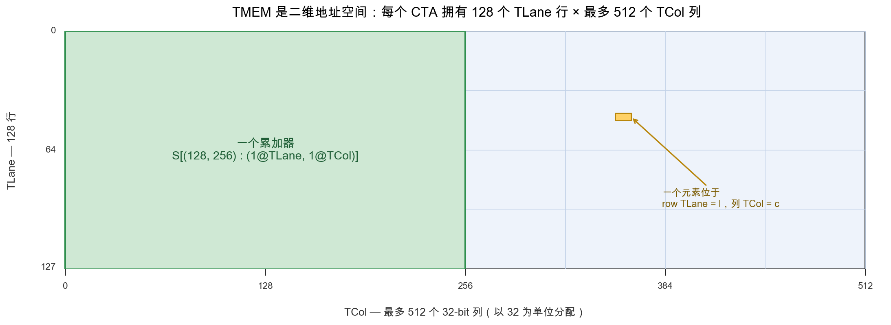
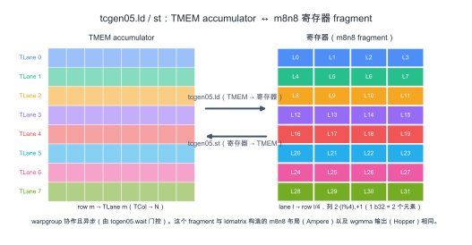

(zh_chap_tmem)=
# 特殊内存：TMEM

:::{admonition} 概览
:class: overview

- TMEM 是 Blackwell 专有、供 `tcgen05` 使用的内存空间。它是每个 SM 上的二维 scratchpad，拥有 128 个 Lane row 和最多 512 个 Col column。
- `tcgen05.mma` 把 accumulator 写入 TMEM。block-scaled MMA 也使用 TMEM 存放 scale factor。
- TMEM 通过 Lane 和 Col 寻址。在 TIRx layout 记法中，这两个硬件轴写作 `TLane` 和 `TCol`。
- TMEM 不像寄存器那样自动分配。kernel 必须以 32 column 为单位显式分配并释放它。
- 普通 shared-memory load/store 不能访问 TMEM。数据通过专用异步 `tcgen05` 指令在 TMEM、寄存器和 shared memory 之间移动。
:::

在 Hopper 及更早 GPU 上，Tensor Core（{ref}`zh_chap_tensor_cores`）accumulator 位于寄存器中。
这个模型很容易推理：MMA 指令产生一个 register fragment，kernel 在 compute phase 中保持这个 fragment live，
epilogue 稍后读取它、转换它，并存储结果。

问题在于 register pressure。寄存器是固定的 per-thread 资源。随着 MMA tile 变大，accumulator fragment 也会变大。
到某个点，accumulator 会开始挤占 thread 还需要保存的其他值。更大的 tile 有利于 Tensor Core 吞吐，
但把整个 accumulator 保存在寄存器中，会让这些更大 tile 更难使用。

Blackwell 改变了数据路径的这一部分。`tcgen05` 的 accumulator 不必在整个 compute phase 中停留在寄存器里。
相反，`tcgen05.mma` 会把 accumulator 写入 Tensor Memory，也就是 TMEM。
TMEM 是早期 NVIDIA GPU 没有的内存空间。它是 SM 上的二维 scratchpad，形状为 128 个 Lane row × 最多 512 个 Col column，
作用域是使用它的 CTA。

这个额外内存空间让 Blackwell 能支持更大的 Tensor Core tile，而不必强迫整个 accumulator 进入 per-thread register。
但 TMEM 并不像寄存器那样自动。编译器不会把它当作普通 register storage 简单发放。
kernel 必须分配 TMEM，用正确 layout 寻址它，用正确指令把数据移入移出，并在 CTA 完成后释放它。

## 二维地址空间

TMEM 不是平坦 byte array，而是一个二维地址空间。硬件把它的两个坐标命名为 Lane 和 Col。
它有 128 个 Lane row，以及最多 512 个 Col column。每个 Col 是一个 32-bit column。

这个形状很重要，因为 `tcgen05.mma` 会使用这个二维结构把 accumulator 写入 TMEM。
一个 TMEM location 由 Lane coordinate 和 Col coordinate 描述，而不是由单个 shared-memory-style byte offset 描述。

当 kernel 在 TIRx 中声明 TMEM buffer 时，它会给这个 buffer 一个覆盖这两个硬件坐标的 layout。
在 layout 记法（{ref}`zh_chap_data_layout`）中，我们把 TMEM Lane 轴写作 `TLane`，把 TMEM Col 轴写作 `TCol`。
这些名字并不是为了替代官方硬件术语，而是 layout axis name，用来在 DSL 中显式标出 TMEM 维度。

例如，一个 accumulator tile 可以写成：

```text
S[(128, N) : (1@TLane, 1@TCol)]
```

这表示 tile 沿硬件 Lane 维度有 128 行，沿硬件 Col 维度有 `N` 列。
在 layout 记法中，这两个维度表现为 `TLane` 和 `TCol`。这个 layout 是直接映射：
相邻 row 沿 `TLane` 移动，相邻 column 沿 `TCol` 移动。下图展示了这个网格：
hardware Lane 沿 128 行向下，hardware Col 跨 column 横向展开。



重点是：TMEM 是 tile layout 故事的一部分。它不只是 Tensor Core 背后的隐藏 backing store。
kernel 必须命名这块内存，从中分配 column，并使用匹配 `tcgen05` 指令读写方式的 layout。

## 分配

kernel 使用 TMEM 之前，必须先在其中预留空间。这不同于寄存器。寄存器由编译器分配，而 TMEM 由 kernel 显式分配。

分配按 CTA 完成。CTA 中的一个 warp 请求一段 TMEM column。请求以 32 column 为单位，
请求的 column 数会根据硬件分配规则向上取整。分配后，CTA 收到一个 base TMEM address。
后续 `tcgen05` 指令使用这个 base address 访问预留区域。

把 TMEM 看作一种有预算的 CTA 资源很有用，类似 shared memory。CTA 拥有自己分配到的 TMEM column。
kernel 决定 accumulator、scale factor 或 temporary staging 需要多少 column。CTA 完成后，必须释放这次分配。

这让 TMEM 成为 kernel resource planning 的一部分。更大的 accumulator tile 可能提升 Tensor Core 吞吐，
但它会消耗更多 TMEM column。block-scaled MMA 可能需要额外 TMEM 空间来存放 scale factor。
kernel 必须让这些用途适配可用 TMEM 预算，就像它必须让 shared-memory buffer 适配 SMEM 预算一样。

## 读写 TMEM

普通 `ld.shared` 和 `st.shared` 指令不能访问 TMEM。TMEM 是独立地址空间，因此数据通过专用 `tcgen05` 指令移动。

主要有三条路径。

第一条路径是 `tcgen05.ld`，它把数据从 TMEM load 到寄存器。这是 epilogue 在 MMA phase 之后使用的路径。
accumulator 已经在 TMEM 中产生，但 epilogue 通常需要一个 register fragment，以便 cast、应用 elementwise operation，
并存储最终结果。

在 DSL 层面，TMEM load 分布在一个 warpgroup 上。它 lower 成四个 warp-level `tcgen05.ld` 操作，每个 warp 一个。
每个 warp 处理 128 个 TMEM Lane row 中的 32 个，因此四个 warp 合起来覆盖完整 Lane 维度。
在 layout 记法中，这个完整维度就是 `TLane` 轴。

这条指令本身来自一组 load shape，例如 `.16x64b`、`.16x128b`、`.16x256b`、`.32x32b` 和 `.16x32bx2`，
repeat factor 从 `.x1` 到 `.x128`。所选 shape 决定读取多少 TMEM column，以及每个 thread 接收多少寄存器。

重要结果是 register fragment layout。对于常见 epilogue 路径，lane `l` 会接收来自 TMEM row `l / 4` 和两列的值。
这产生了与早期世代直接从 MMA 暴露出的 per-lane accumulator fragment 同类的结构（{ref}`zh_chap_layout_generations`）。
这种连续性很重要。它意味着即使 accumulator 在 compute phase 中位于 TMEM，Blackwell epilogue 仍然可以复用
Ampere `mma` 或 Hopper `wgmma` 已经使用过的同一种 register-level cast 和 store 结构。



第二条路径是 `tcgen05.st`，它把数据从寄存器 store 回 TMEM。这是 `tcgen05.ld` 的反方向。
当 thread 已经持有 register fragment，并且需要把它放入 TMEM 时会使用它。
例如，某些 operand 或 intermediate value 可能会先通过寄存器 stage，然后写入 TMEM，供后续 `tcgen05` 操作使用。

第三条路径是 `tcgen05.cp`，它把数据从 shared memory copy 到 TMEM。这是一条 bulk copy 路径，
常用于 block-scaled MMA 中的 scale factor。在这种情况下，TMA 或普通 thread code 先在 shared memory 中准备 scale data，
`tcgen05.cp` 再把它移入 Tensor Core 期望的 TMEM layout。

三条路径都是异步的。`tcgen05.ld`、`tcgen05.st` 或 `tcgen05.cp` 指令都可能在数据移动完成前返回。
因此，kernel 必须在消费结果或复用 storage 前使用正确的 completion mechanism（{ref}`zh_chap_async_barriers`）。

wait path 取决于指令。`tcgen05.ld` 通过 `tcgen05.wait::ld` 完成。`tcgen05.st` 通过 `tcgen05.wait::st` 完成。
`tcgen05.cp` 像 `tcgen05.mma` 一样，通过 commit group 和 `mbarrier` 完成。
如果数据从一组 thread 交给另一组 thread，kernel 可能还需要 fence，确保接收方 thread 按预期顺序看到已经完成的写入。

TMEM 位于 Blackwell Tensor Core 数据路径的中间。TMA 把 operand stage 到 shared memory。
`tcgen05.mma` 读取 operand，并累加到 TMEM 中。对于 block-scaled MMA，scale factor 也可以 stage 到 TMEM 中。
compute phase 之后，`tcgen05.ld` 把 accumulator 带回寄存器，epilogue 转换并存储最终输出。
